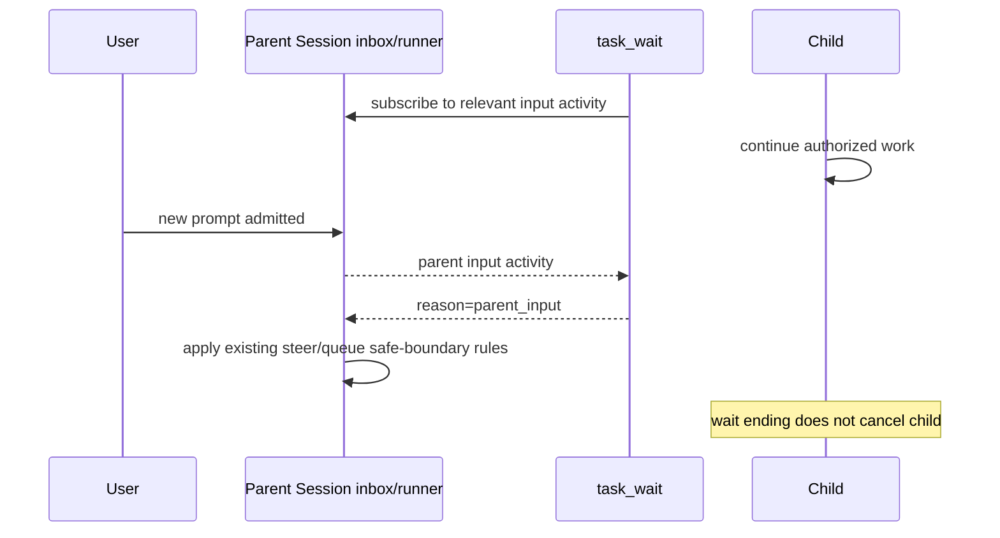
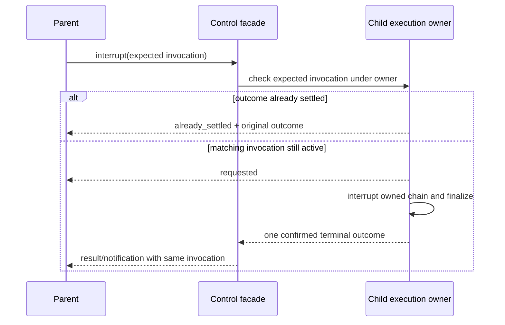
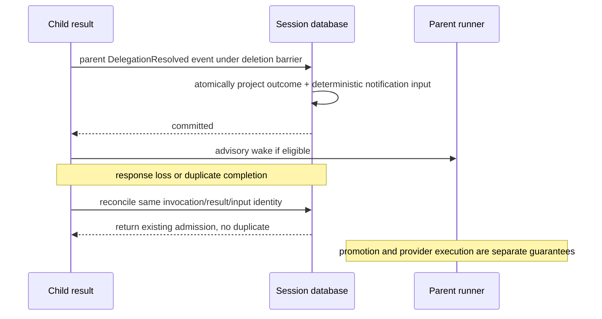

# RFC-0015：父会话作用域的子 Agent 控制面

## 摘要与评审状态

本 RFC 定义一套可查询、可等待、可中断、可接续的子 Agent 控制面。子 Agent 仍然是 Session；一次委派仍然由已有 Task 工具调用及其子输入标识，不创建第二套 Agent 运行时、任务执行器或持久化 Session drain。

核心决策是：**Session 承载连续上下文，Task invocation 标识一次委派，执行状态来自当前进程的明确观测，结果通知通过 Session 自己的输入机制交付。** 用户、父 Agent 和 TUI 消费同一个类型化视图，不能分别从最后一条文本猜测状态。

这是 issue [#432](https://github.com/hammershock/opencode-transit/issues/432) 的设计稿。文中的 MUST/必须是提议的规范契约，接受前不得据此启用新运行时行为。现有缺陷修复 #429/#430 由独立任务负责，本 RFC 不改变其所有权。

## 问题与目标

已确认的现象包括：子任务卡在文件工具时父 Agent 只看到笼统取消；同一个子 Session 被多次委派后，旧进度容易被误认为当前调用进度；查询现场需要直接读数据库；没有新输出不能说明任务是在推理、等待权限还是底层工具阻塞。

目标：

1. 父 Agent 能直接查询自己委派的工作及已确认结果，不需要数据库、日志搜索或 shell 轮询。
2. 复用子 Session 时，每次委派及其结果可独立归属，旧事件不能覆盖新调用。
3. 等待、中断、提供当前任务的补充信息、提交下一项任务具有不同且稳定的语义。
4. 用户输入可以打断父 Agent 的等待，而不意外取消子 Agent。
5. 重启、重连和多设备同步后如实呈现已有事实，不虚构存活状态或自动重放模型工作。
6. 保持现有 Location、权限、Session inbox、事件和工具注册边界；兼容 legacy Task 的分阶段接入。

非目标：任意 Agent 互聊、跨 root 协作网、集群执行所有权、远程常驻作业调度器、自动重试模型或外部副作用、自动选模型、无限制后台 Agent、自动为文件工具设置超时。

## 从 Codex 借鉴什么

参考固定提交 `openai/codex@50d77959bf927293c4b5ddcca81d05331ae582ea`，不假设本机 Codex 或所有发布版本都启用了这些特性：

| 参考机制                                                | 本 fork 的取舍                                                             |
| ------------------------------------------------------- | -------------------------------------------------------------------------- |
| 工具运行时拥有 cancellation token，并保护已先完成的结果 | 由 #429 修复，控制面消费其结果，不另建取消执行器                           |
| 协作事件同时记录 call ID 和 child thread ID             | 由 #430 提供关联；控制面沿用，不分配新的 drain/run ID                      |
| root tree 内的 AgentControl、状态订阅                   | 保留树内边界；v1 进一步限制为调用者直接委派的子 Session                    |
| v1 针对选定 Agent 等待终态                              | 采用“固定本次目标 invocation，再订阅”的语义                                |
| v2 mailbox 或用户输入可唤醒 wait                        | 借鉴事件驱动唤醒；复用现有 Session inbox，不引入第二个 mailbox             |
| followup 与普通消息、中断分离                           | 新任务使用 `task`，当前任务补充使用 `task_send`，中断使用 `task_interrupt` |
| 有界、去重的近期活动预览                                | 由 #431 落实；状态不从预览文字反推                                         |

Codex 将 `Interrupted` 视为可继续状态，并不等于本 RFC 的 invocation 已取消。本 RFC 不照搬其枚举、AgentPath、Rust/Tokio 实现、权限模型或完整控制协议。

## 一、对象、身份与所有权

### 1.1 三种不同的对象

| 对象                | 身份与生命周期                                                                       | 所有者                                |
| ------------------- | ------------------------------------------------------------------------------------ | ------------------------------------- |
| 子 Session          | 既有 Session ID；完成一次工作后仍可复用                                              | Session domain                        |
| 委派调用 Delegation | 父 Session + 父 assistant message + tool call 的已有复合身份；关联 #430 的子输入边界 | 父 Session 中的 Task 调用及其事件投影 |
| 执行观测            | 当前进程对该调用的运行、等待及取消观测；重启失效                                     | 当前 Session 执行所有权链             |

对外保留 `task_id` 表示子 Session；增加的 `invocation` 引用由 #430 的既有调用身份编码，不另建全局自增任务号。以下类型仅表示语义，最终 schema 命名遵循仓库规范：

```ts
type InvocationRef = {
  parentSessionID: string
  parentMessageID: string
  callID: string
}

type TaskTarget = {
  task_id: string
  invocation: InvocationRef
}
```

`status` 可以请求一个子 Session 的最新委派；返回值必须给出解析后的具体 invocation。`wait` 在开始时固定这个引用；`send` 和 `interrupt` 必须携带它，禁止把迟到的操作应用到后来启动的新任务。

既有父工具 part、子输入和消息关联是事实来源。需要索引时允许增加 **Session-owned 的事件投影**，但该投影不运行任务、不拥有新调度状态、不成为第二套 `BackgroundJob`。没有相关历史的旧 Session 不能仅因为 `parent_id` 相同就伪造精确 invocation 边界。

其中 `callID` 明确指父 assistant 消息内持久工具 part 的 `callID`，不是 part 的数据库 `id`，也不是某个插件事件误用的同名字段。#430 若以 part ID 提供内部索引，适配器必须保存并验证两者映射；主子输入接纳时持久携带完整关联。RPC caller 的身份来自实际调用上下文，不接受请求体伪造 parent 身份。

### 1.2 权限边界

v1 的模型工具只操作**当前调用者直接委派**的子 Session 及其 invocation：

- 父子关系从持久 Session 与 Task 关联校验，不能信任传入的 parent ID、路径、昵称或模型名。
- 知道另一个 Session ID 不构成访问权；越界与不存在统一返回 `not_found_or_forbidden`。
- 默认不能读兄弟、祖先、其他 root 或其他项目的 Session。根用户在 TUI 的人工浏览权限不等于模型工具权限。
- `task_send`、`task_interrupt` 分别经过执行 leaf 的正常权限检查。状态工具也不得绕过已有 deny。
- 继承父审批模式与子 Agent 自身 deny 保持 #422 的契约；新增工具不自动授予子 Agent 继续委派的权限。
- 接收方 Session 的当前 Location、解析状态和权限才决定实际执行；不使用调用者 cwd 或控制机路径兜底。

本 RFC 不放宽 RFC-0009 既有的 rebind 边界。委派关联必须记录子输入接纳时的 Location revision；控制操作同时核对该 revision，不能把旧 invocation 重新解释为新 Location 上的工作。允许的 rebind 完成后，旧结果仍可读；旧非终结调用若失去可确认的原 owner，则报告 unknown/unavailable，不能按新的 placement 自动恢复或中断其他工作。

### 1.3 一次任务完成不等于一个 Agent 消失

`task(task_id: child, ...)` 是向已有子 Session 提交**下一次委派**，不是修改上一项任务的结果，也不是自动从崩溃处继续模型调用。后续 invocation 拥有新的父工具调用身份；子会话历史继续保留。

一个 provider turn 可以接纳多个 steer 输入，不能据此制造新的 Task invocation；一次 Session drain 也不能被当成一次委派的稳定身份。

## 二、状态模型：事实与观测分开

```ts
type TaskView = {
  target: { task_id: string; invocation?: InvocationRef }
  description: string
  lifecycle: "admitted" | "active" | "settled" | "unscoped_legacy"
  outcome?: "completed" | "failed" | "cancelled"
  runtime: "observed" | "unavailable" | "unknown"
  phase: "queued" | "model" | "tool" | "permission" | "question" | "unknown"
  cancellation: "none" | "requested" | "observed"
  lifecycleSource: "durable" | "legacy_projection"
  runtimeSource: "execution_owner" | "none"
  observedAt: number
  lastProgressAt?: number
  activeTool?: { name: string; callID: string; startedAt?: number }
  result?: { messageID: string; summary?: string; truncated: boolean }
}
```

约束：

- 只有确切关联的终结事件才产生 `settled + outcome`；没有输出、父工具已返回、网络断开都不是完成证据。
- `runtime: observed` 表示查询时有当前进程的执行/等待观测，不是远端 OS 进程健康证明。
- `unknown` 表示没有足够的当前执行观测，例如重启后只有非终态记录；`unavailable` 表示尝试访问适用的 live owner/adapter 时明确失败或其不可达。二者都不改写持久 outcome。
- lifecycle/outcome 与 runtime/phase 可以分别来自持久记录和 live owner，因此不得用一个笼统的 live/durable 标签覆盖整个 view。legacy_projection 表示关联信息只能由旧 part 投影得到，不冒充 canonical 输入结算事实。
- `observedAt` 是本次观测/读取时间；`lastProgressAt` 是真正收到进度事件的时间，不能用轮询时间刷新它。
- `permission`、`question` 必须来自真实未决请求。旧文字中的“等待批准”不能改变状态。
- `active + runtime: unknown` 是合法组合：历史上开始执行，但现在无法证实是否还运行。UI 必须显示“运行状态未知”，不能显示正在思考。
- 查询结果不得携带原始工具参数、token、完整历史或 transport credential。摘要最多 2 KiB UTF-8；复杂产物仍通过既有受权限约束的文件/消息引用访问。
- 只有 `unscoped_legacy` 可以缺少 invocation；它不能被用作需要精确调用边界的操作目标。
- 运行中断的底层原生 I/O 可能无法撤回；`cancelled` 表示本次 Agent 执行链已终结，不宣称所有外部副作用或用户自行 detach 的作业已停止。

### 2.1 状态转移

| 输入事实                          | 投影变化                                       | 不允许推导出的结论                             |
| --------------------------------- | ---------------------------------------------- | ---------------------------------------------- |
| 已持久接纳子任务输入              | admitted / queued                              | 模型已经开始                                   |
| 输入晋升，执行 owner 已观测到执行 | active / 实际 phase                            | 整个子 Session 永远 running                    |
| 精确关联的结果完成                | settled / completed                            | 测试成功或用户目标已达成；这些仍由结果证据说明 |
| 已确认执行失败                    | settled / failed                               | 应自动重试                                     |
| 用户/父 Agent 请求中断            | cancellation=requested                         | 已经停止                                       |
| 执行层确认本次调用被取消          | settled / cancelled，cancellation=observed     | 子 Session 被删除                              |
| 重启后只有非终结持久记录          | 保留 lifecycle，runtime=unknown，phase=unknown | 恢复后台任务或重发 provider 请求               |
| 既有任务已完成，再提交 task       | 新 invocation admitted                         | 改写旧 invocation                              |

完成与取消竞争时，以执行层已经确定的唯一终结结果为准；重复投影必须幂等。#429、#433 提供的终结契约不在控制面重复实现。

## 三、工具面与 API

保留 `task`，新增四个语义明确的工具。工具名在 RFC 接受后才成为发布契约：

| 工具             | 作用                                                  | 是否可能启动新的模型工作       |
| ---------------- | ----------------------------------------------------- | ------------------------------ |
| `task`           | 新建子 Session 或向已有子 Session 提交下一次委派      | 是，仍需现有 Task 权限         |
| `task_status`    | 列出直接子任务或查询指定 invocation，包括有界最终结果 | 否                             |
| `task_wait`      | 等待选定 invocation 的状态变化或需要关注的事件        | 否；超时不影响子任务           |
| `task_send`      | 给正在执行的指定 invocation 补充信息，在安全边界接纳  | 不得因目标已 idle 而启动新任务 |
| `task_interrupt` | 请求中断指定 invocation                               | 否                             |

模型工具、TUI、Server/Client 共用同一个 Core 控制服务与 schema。控制机侧服务可以按 Session ID 路由，但 filesystem、模型解析、工具执行与 Permission leaf 仍归属于对应 Location。不得从工具里开第二条 SSH 或直接调用 shell 查子任务状态。

### 3.1 task_status

```json
{
  "targets": [{ "task_id": "ses_child" }],
  "include_results": true,
  "limit": 20
}
```

不传 targets 时分页列出当前调用者直接委派的子 Session，返回每个子 Session 最新 invocation；targets 每项可附带明确 invocation 引用查询旧结果。显式 targets 必须非空，最多 32 项，且不能与分页 cursor 混用；列表 limit 默认 20、最大 50，使用不含机器路径的 opaque cursor。

返回 `items: TaskView[]`、`nextCursor?`。列表按最近委派的持久顺序排序，不根据不断刷新的查询时间重排。未知/不可访问的显式目标返回相同错误；不得部分返回其他目标内容来泄露越权集合。

分页 cursor 固定首次枚举的父事件顺序上界与最后一个条目键，后续页不混入新委派；每个已固定条目的执行状态仍按查询时观测。include_results 默认 false；true 才附带有界结果摘要，消息引用本身不绕过内容读取权限。

读取和再次读取同一个结果不消费通知，不触发模型，也不改变调用状态。

对于 task_send 的送达对账，显式 targets 查询可以附加最多 32 个 `input_ids`，仅允许查询调用者向这些 invocation 发送过的输入。返回独立的 `receipts`，字段为 `input_id / state(admitted|promoted|not_delivered) / reason?`，不重复返回消息正文。调用者因此可以区分接纳与实际晋升，而不用读取数据库。

### 3.2 task_wait

```json
{
  "targets": [
    {
      "task_id": "ses_child",
      "invocation": {
        "parentSessionID": "ses_parent",
        "parentMessageID": "msg_parent",
        "callID": "call_task"
      }
    }
  ],
  "until": "terminal",
  "timeout_ms": 30000
}
```

- targets 必填、非空，最多 32 项；不隐式等待未来新出现的任务。
- `until` 为 `terminal` 或 `state_change`，默认 terminal。permission/question、runtime 不可用和父新输入均是提前返回的关注事件。
- timeout 默认 30,000 ms，合法范围 1,000–120,000 ms，超范围明确拒绝，不静默变成无限等待。
- 返回 `{ reason, items, timed_out }`；reason 为 `terminal | state_changed | needs_input | parent_input | unavailable | timeout`。只有 timeout 对应 `timed_out=true`。
- terminal 模式在任意目标终结时返回，并包含同一观测点已终结的其他目标；不等待最慢的那个。
- 已终结目标立即返回。先校验授权，再订阅，再读取/协调快照，避免完成发生在查询与订阅之间而丢失唤醒。
- state_change 的起点是在注册订阅后取得的初始快照，只有有意义的生命周期/phase/阻塞变化唤醒；token delta 和定时刷新不构成变化。
- 新的父用户 steer/queue 输入都唤醒 wait，使父 runner 回到现有输入处理边界。wait 不决定该输入何时晋升，不修改 steer/queue 规则。
- 父输入唤醒只针对新接纳的用户输入；delegation-result 通知通过相应 invocation 事件处理，不把自己的完成通知误报为用户打断。多个事件同时可见时，先协调一次状态快照，以 terminal、needs_input、unavailable、parent_input、state_changed、timeout 的顺序选择 reason，items 保留该观测点的信息。
- 取消父 wait 只清理 waiter，不中断子任务。显式 `task_interrupt` 才控制子任务；现有 foreground `task` 的取消所有权保持其既有契约。
- 关闭/失去订阅 owner 时返回 unavailable 或工具中断，不把丢失观测当作成功。

等待服务复用现有 Session 事件，并在既有 execution owner 上增加所需的观测订阅接口；当前只有 active 快照的接口不被假定已具备订阅能力。该 stream 是 owner 的观察出口，不建立第二份活跃任务真值表。不轮询数据库、不执行 sleep shell、不让模型反复请求同一状态。工具的有界等待不是子任务 deadline；用户选择继续等待时不会重启子任务。

### 3.3 task_send：仅针对当前工作

```json
{
  "task_id": "ses_child",
  "invocation": {
    "parentSessionID": "ses_parent",
    "parentMessageID": "msg_parent",
    "callID": "call_task"
  },
  "message": "补充：沿用已经批准的数据格式，不要修改导出协议。"
}
```

返回 `{ input_id, delivery: "steer", state: "admitted" }`，不声称模型已经阅读或应用。消息作为父 Agent 提供的任务数据/指令接纳，不升级成用户授权或系统规范。

它复用 Session durable input 与安全边界晋升，但需要一个明确的 **active-only admission** 契约：

1. 校验目标 invocation 仍是正在执行、可接纳 steer 的任务；idle、排队任务或 runtime unknown 返回 `not_running`，提示使用 task 提交下一项工作。
2. 输入关联目标 invocation，复用当前 runner/coordinator 的串行边界进行接纳，不能只先查 active 再无条件调用普通 prompt。
3. 若接纳后、晋升前目标任务已经结束，记录该输入的 `not_delivered` 处置及原因；它不成为后续新 invocation 的提示，也不能单独唤醒 idle Session。
4. 这一有限的“带接收目标条件的输入”扩展由 Session inbox 拥有；不得另建控制面内存 mailbox。普通用户 prompt 的原有语义不变。
5. caller 请求重试以现有工具调用身份映射到同一个 input_id；相同内容与 delivery 精确重试可对账，冲突重用报错。

请求权限/等待用户回答不授权父 Agent 代替用户批准。消息不能解除子 Agent deny，也不能绕过既有工具授权。

### 3.4 task：新任务与 follow-up

保留现有参数与 `task_id` 续用方式。控制面启用时，向已知子 Session 提交 follow-up 使用 Session 的 **queue** delivery：当前任务到空闲边界后才晋升下一项，每次晋升后重新评估继续条件。

新 invocation 的关联必须在子输入可能开始执行之前建立；每次 follow-up 返回自己的调用关联。相同 task_id 不合并多个委派的最终结果，也不以 BackgroundJob 的“最后一个输出”覆盖前面的结果。

新功能路径中，用户明确给了不存在/不属于自己的 task_id 时应报错，不静默新建另一个子 Session。这是一个有意收紧的兼容点，仅随本 RFC 开关启用；关闭时不借此重写历史行为。

queue 接纳不等于执行。只重试通知、状态查询或 parent wait 都不能导致重复子输入。既有 `background` 与 foreground 默认值保持不变，不因为新增控制工具就自动开启后台执行功能。

### 3.5 task_interrupt：带预期调用的中断

请求包含 `TaskTarget` 和可选的有界原因文本。先校验关系，再按下列顺序判断，不能用后面的 live 状态覆盖前面的持久终态：

- invocation 已终结：返回 `already_settled` 与其 outcome，不改写结果；即使子 Session 已开始另一项任务，此规则仍优先。
- invocation 尚未晋升：通过 Session inbox 的取消处置使该输入不再被执行；历史记录保留。
- invocation 正在执行：在执行 owner 下校验预期调用，再请求已有 Session interruption；返回 `requested`。真实终结由后续状态/通知报告。
- 请求的 invocation 没有可确认终态、也不是可取消的 pending input，但执行 owner 已关联另一 invocation：返回 `invocation_conflict`，绝不取消后来任务。
- 没有可用执行 owner、target 未解析或断连且无法确认取消：返回 `unavailable`，不能直接写 cancelled。
- 重复请求幂等。它不删除 Session，不终止无关子 Session，也不猜测并 kill 用户独立启动的训练进程。

这里只控制指定 invocation，未晋升的其他 follow-up 保留。若要全部停止，调用者需显式列出并取消各 invocation；取消后到新输入晋升的竞态也必须受同一 Session coordinator 约束，不能用裸 Session-ID interrupt 误伤下一项任务。

推荐的明确选择是：**task_interrupt 不暂停整个子 Session 的队列**。当前 invocation 取消清理完成后，owner 可继续执行已授权、仍 eligible 的 queued follow-up；返回结果和 UI 应说明其他排队任务仍保留。要停止整批已知工作，应先取消相应 pending inputs，再中断 active invocation。精确中断原语必须补齐现有 `SessionRunCoordinator.interrupt` 清空 pending wake 后的队列接续，不能假设原有 Session-ID interrupt 会自然继续队列。用户直接停止整个 Session 的既有行为不因此改变。

## 四、结果、通知与父会话接续

### 4.1 唯一结果事实

每个 invocation 以精确关联的完成消息/失败/取消事件确定最终结果，在父 Session 的 delegation projection 中记录一次。重复事件不增加第二个结果。Task 工具 part 已在后台启动时返回，不意味着子 invocation 已终结；工具调用返回状态和工作生命周期必须分别表示。

对于 canonical 路径，invocation 关联的主子输入 ID 是 `SessionTurn.find/awaitSettlement` 的查询键，消费既有 `SessionEvent.Turn.Settled` outcome；同一逻辑继续过程中的 steer 输入可共享一次完成结果，但不产生新的委派调用。结果 assistant message 引用必须在对应结算边界捕获并持久记录，必要时扩展该 Session-owned 结算事件，不能事后取整个子 Session 的最后一条 assistant 消息。

foreground：结果通过原 Task 工具结果返回，不再追加一条同内容的完成输入。

background 或被用户提升到后台的 invocation：终结后生成一个父 Session 输入通知。v1 只自动投递 completed/failed/cancelled 三种终结结果；普通进度不进入父模型上下文。权限与问题使用已有交互通道，`task_wait` 可提前返回 needs_input。

### 4.2 使用已有 durable inbox，明确保证范围

通知使用 Session-owned input，携带 `origin=delegation-result` 的来源标识、TaskTarget、outcome 和有界摘要/结果引用。它不是冒充用户的新指令，也不能提升子输出的可信等级。

具体采用**一个父 Session aggregate 的复合 durable event**，建议命名 `DelegationResolved`，同时投影 invocation outcome 和可选的 notification input；不假定现有 EventV2 支持两次 publish 的原子批量追加。child terminal 已先独立提交，child 与 parent 两个 aggregate 之间不承诺跨聚合原子性。

复合 event 包含 invocation、确切 child terminal 引用、不可变 outcome、结果引用、通知 input_id/模板版本及受信任的来源 envelope。origin 是 Session-owned 内部接纳元数据，普通 Prompt/用户文本不能设置或伪造它；当前输入 schema 必须显式扩展，而不是在文本里拼一个可信标签。投影器复用 SessionInput 接纳投影，不建立独立通知队列。

通知 input_id 从父 Session、invocation 与唯一终结结果身份确定；精确重试先对账已有复合 event/输入，复用相同内容与模板版本。父 invocation 与结果身份构成幂等键，重复追加不能产生第二个输入。

父存在性、删除 tombstone/remove-wins 检查及这一复合 event 提交必须处于同一父 aggregate 追加/删除屏障下。仅依靠输入表外键，或在事务外检查“父还存在”，都不满足同步删除不复活的契约。通知生产者在事务后只发 advisory wake，**不得等待父晋升或父模型执行**，避免父 task_wait 与 child 结果投递形成循环等待。

如果 child 的终结事件已持久化，而父事务尚未提交就发生崩溃，可在父会话显式激活/查询时根据已关联的 child 终结事实补齐**结果记录与通知输入**；不能重跑 child 来“补齐结果”。缺少明确关联时保持 unknown，不用最后一条 assistant 文本猜测。

冷恢复补齐使用 record-only 的内部 workflow，不能调用默认会 wake 的普通 Session prompt。sync 导入同一复合 event 只重建投影，不获得本机自动唤醒资格。

保证是：**在本地可用的持久 Session 存储中，一个终结结果只接纳一份相同通知，通知可重新观察。** 不承诺网络 exactly-once、模型只调用一次或外部副作用可回滚。

### 4.3 何时唤醒父 Agent

| 父状态                                      | 接纳与唤醒                                                   |
| ------------------------------------------- | ------------------------------------------------------------ |
| 正在执行，包括停在 task_wait                | 接纳为 steer；wait 因语义事件结束，runner 在既有安全边界晋升 |
| 当前进程中正常 idle，后台委派仍由该进程拥有 | 接纳并 advisory wake，延续用户已授权的后台协作               |
| 用户明确停止/取消父当前工作                 | 仅持久接纳，不因此重新启动父模型；下次用户继续时可见         |
| 应用重启、冷恢复或仅从 sync 导入            | 仅恢复/补齐结果和通知，不自动 wake 或重试 provider           |
| 父 Session 已删除或有删除 tombstone         | 不创建父消息、不复活父 Session；沿现有删除规则处置关联记录   |
| 父的 Location 未解析/不可执行               | 记录可查询结果，不执行本地兜底、不启动模型                   |

“用户明确停止”作为已有父执行中断事实与委派通知的自动唤醒资格关联，不引入全局永久暂停开关。一次明确的新用户提交可恢复该父会话的正常输入处理；结果查询本身不能恢复自动模型执行。

后台通知是否已接纳和是否已被父 runner 晋升应分别可检查。父模型读过结果不等于任务已验收，用户仍可查看原始关联输出。

## 五、架构与 legacy/Core 接入

### 5.1 所有权

| 层                      | 责任                                                               | 不负责                                      |
| ----------------------- | ------------------------------------------------------------------ | ------------------------------------------- |
| Schema / Protocol       | 可序列化请求、结果、错误及新增 Session 事件契约                    | 进程句柄、实际文件路径绑定、运行调度        |
| Core Session/delegation | 父子授权关系、调用关联、持久结果/通知投影、idempotency             | 新的模型循环、provider 自动重试             |
| Core 控制 facade        | 按 caller/child Session ID 组合状态、wait 与命令；派发到现有 owner | process-local job map 的独立复制            |
| Session input/execution | 接纳、active-only 条件、queue/steer 晋升、精确中断与执行           | UI 猜测的状态、额外 mailbox                 |
| Location 工具 leaf      | 获取 Permission/Location services，执行授权并调用 facade           | registry 层集中授权或第二种工具表示         |
| Server / Client / TUI   | 复用 typed workflow；展示当前调用、历史、通知状态                  | 直接查库、绕过 Core 发 prompt、私有进程管理 |

SessionExecution 继续是 process-global、Session-ID based；LocationServiceMap 仅在实际执行或查询其执行 owner 时解析 placement。控制 facade 不持有一份独立的“活跃 Agent 真值表”。实时观测可以缓存，但必须能说明其来源与失效状态。

### 5.2 原子控制边界

现有 Session-ID 级 active/interrupt 不足以实现“先检查 invocation，再中断”的原子性。必须在**同一个 Session coordinator/runner 所有权链**内补充带 expected child input ID 的控制操作：

- runner 在晋升输入、开始新 queue 工作、终结当前逻辑继续过程与释放所有权时，更新它已经处理的输入关联；这些是现有 input IDs 的进程内观测，不是新的持久 run ID。
- active-only admission、pending cancel 和 expected-invocation interrupt 的条件校验，与对应输入提交/取消意图的线性化使用同一串行边界。不得先调用外部 status 再调用裸 interrupt/prompt。
- 边界只保护短的状态检查、数据库提交和取消请求，不持有跨 provider/tool/network 等待的锁。
- task_send 与 idle 转移竞争：要么在可继续任务下接纳并登记 guard，要么在 idle 后拒绝；已接纳而尚未晋升的 guarded input 在任务终结时，通过 Session-owned 的取消/未送达处置排除出后续 pending 查询，并留下 receipt。
- 若取消 pending input 时发现它刚晋升，必须重新走同一 owner 的 expected-invocation 分支，不能在外部循环无条件中断整个 Session。
- 对 active invocation 的精确中断在清理后重新检查保留的 eligible queue，并按 §3.5 的调用级中断语义接续；这与用户停止整个 Session 的语义分开。

Core inbox 已有 `SessionTurn.cancelPending` 等能力，但 guard/receipt 和 expected-invocation 操作仍需显式扩展并测试。legacy adapter 没有实现这一原子契约时必须返回 unsupported，而不是声称“尽力检查”已经等价。

### 5.3 基线中的实际缺口

当前 Task 位于 `packages/opencode/src/tool/task.ts`，调用 legacy `TaskPromptOps`；`BackgroundJob` 用子 Session ID 维护进程内等待与末次输出。Core 的 durable inbox 和 V2 runner 并非已被这条链完整消费。不能仅添加几个工具名，就宣称获得本 RFC 的持久接纳与通知保证。

采用显式的两段接入：

1. **可观测性阶段**：兼容适配器将既有 Task metadata、#430 关联和进程执行状态映射到统一视图；status/wait/精确 interrupt 在各 adapter 真正支持的范围内验证。缺失的 active-only admission 或通知能力必须报告 unsupported，不能通过直接 `ops.prompt` 偷偷模拟。
2. **完整控制面阶段**：将新功能路径的 Task 接纳、消息和通知汇入同一个 Session durable input/执行工作流；legacy 只保留工具调用、展示及协议兼容适配，不能再同时让 BackgroundJob 与 Session runner 各运行一次子任务。可以复用 BackgroundJob 的宿主等待实现，但其注册项不是 invocation 结果事实来源。

底层实现可以按阶段合入；对用户开放完整工具面必须通过统一 capability gate，不能在不同入口冒充同一语义却偷偷降级。迁移不要求立即删除整个 legacy Session runtime，但提供 RFC 保证的入口必须消费共同接纳/结算契约。

### 5.4 启用与兼容

建议新增 `experimental.subagent_control: true`，默认关闭。开关关闭时不暴露新模型工具、不会改写旧任务的接纳/通知语义；#429/#430/#431/#433 的独立缺陷修复不依赖它。

这里的 backend 指 Core/legacy **执行接纳适配能力**，不是把 local/Rexd 两类 Location 当成两套产品语义。四个新模型工具仅在 backend 的完整 capability 成立时整体暴露；部分 legacy 观测只供 TUI/API 诊断显示，并显式报告缺失能力。不得把 legacy SessionPrompt.cancel(sessionID) 冒充精确 invocation 中断，也不得回退本地执行或旧的不持久消息路径。完整工具面是否可用是能力检查，不是新的用户权限。

Rexd 断连按操作区分：持久 status/结果仍可查询；当前控制进程确实持有执行 owner 时仍可请求取消其本地所有权链，但必须区分远端副作用是否确认停止；需要新的目标执行依赖的 task/follow-up/send 在 Location 不可用时拒绝接纳。取消尚未晋升的 durable input 不要求先建立远程连接。所有分支都禁止控制机执行 fallback。

旧 Task 历史可查询时标为 `unscoped_legacy`，保留 Session 导航；没有调用边界时不允许精确 send/interrupt 或保证精确结果归属。用户可以明确提交新的委派获得新边界，不自动改写旧记录。

## 六、持久化、同步与恢复边界

- 持久化：父子 Session 关系、Task 调用关联、已接纳的子输入与 active-only guard、送达/未送达处置、调用级取消请求及已确认结果、带受信任来源标识的父通知及晋升事实。
- 不同步：进程/fiber/后台 PID、live phase、订阅对象、permission pending handles、transport 状态、controller target registry、自动 wake 的当前进程资格。
- 已接纳子输出/通知随完整 Session 历史同步，适用现有删除/tombstone规则；不额外同步所有未调用子任务的完整历史。
- 同步副本不会成为活跃执行 owner，也不会由于看到未完成 part 就重发 provider 请求。
- 重启后只能对明确持久终态做结果/通知对账；非终态工作保持 unknown。用户显式恢复执行属于现有 Session 恢复边界，不由 status/wait 隐式触发。
- 跨设备同时执行仍受现有非集群模型限制；本 RFC 不增加抢占/选主/跨控制机中断保证。另一控制机没有 owner 时返回 unavailable。

## 七、关键时序

### 7.1 完成发生在 wait 之前或订阅过程中

```mermaid
sequenceDiagram
  participant P as Parent tool
  participant C as Control facade
  participant S as Session state/events
  P->>C: wait(exact invocation)
  C->>S: validate relation and subscribe
  Note over S: completion may already exist or arrive now
  C->>S: read/reconcile snapshot after subscription
  S-->>C: settled outcome / queued event
  C-->>P: terminal + exact TaskTarget
  Note over C: unsubscribe once; no lost wakeup or child restart
```

### 7.2 active-only 消息与 idle 边界竞争

```mermaid
sequenceDiagram
  participant P as Parent task_send
  participant O as Existing child coordinator/runner
  participant I as Session inbox
  P->>O: admitToActive(expected child input, message)
  alt invocation already idle or changed
    O-->>P: not_running / invocation_conflict
  else active at serialized boundary
    O->>I: commit steer with expected-invocation guard
    O-->>P: admitted + input_id
    alt task continues to promotion boundary
      O->>I: promote guarded steer into same invocation
    else task settles before promotion
      O->>I: record not_delivered; exclude from pending drain
    end
  end
  Note over O,I: no independent wake of an idle/new invocation
```

### 7.3 父用户输入唤醒等待



### 7.4 子任务取消与完成竞争



### 7.5 通知重试



### 7.6 进程重启

```mermaid
sequenceDiagram
  participant U as User
  participant P as Restarted parent
  participant D as Durable Session state
  U->>P: open/query existing task
  P->>D: read correlated inputs and outcomes
  alt known terminal child result
    D-->>P: result; reconcile missing parent notification admission only
  else nonterminal or uncorrelated history
    D-->>P: runtime=unknown / unscoped_legacy
  end
  P-->>U: truthful observation; no automatic provider resume
```

## 八、UI 与 Agent 上下文

新增控制面不是另一份聊天历史。UI 复用 #431 的近期活动和历史区分：

- 当前选中的子 Session、invocation 描述、状态与 last observed 时间明确显示。
- 已知终态、runtime unknown、permission/question 等阻塞各有真实来源。
- 状态查询和有界结果预览不产生模型调用；用户可以检查一个已完成任务而不恢复它。
- 不强制跳到最新任务；新活跃任务提示与当前查看对象分开。
- 父模型只获得可调用控制工具的简短契约及明确结果，不注入全量子历史、provider usage 或 credential。
- RFC-0014 的 economics 仍是独立、device-local 的提示，不进入本 RFC 的持久状态/通知。

## 九、验收矩阵

| 场景                                               | 必须观察到的结果                                                  |
| -------------------------------------------------- | ----------------------------------------------------------------- |
| 相同模型创建两个子 Session                         | 关联与结果互不混淆                                                |
| 同一个子 Session 连续两次委派                      | 两个 invocation；迟到事件不覆盖新调用                             |
| follow-up 到达运行中的子任务                       | durable queue，在空闲边界逐一晋升，不覆盖当前输出                 |
| task_send 与 idle 边界竞争                         | 晋升到正确 active invocation，或明确 not_delivered；不启动新任务  |
| 完成在 wait 前/订阅间发生                          | 即时/及时返回，无丢失唤醒                                         |
| wait 到时或父用户发消息                            | 返回 timeout/parent_input；子任务继续                             |
| 权限等待                                           | 有依据的 needs_input；父 Agent 不能代批                           |
| 旧调用中断请求迟到                                 | 已知终态返回 already_settled；否则按 owner 检查冲突，不误伤新任务 |
| 完成与取消竞态                                     | 一个终结结果；已完成不变成 cancelled                              |
| 同一个结果重复投递                                 | 一份通知输入，可重复查询，无重复模型工作承诺                      |
| 父忙、idle、手动停止                               | 分别在安全边界晋升、获准唤醒、仅记录                              |
| 父删除/同步删除                                    | 不复活父 Session、不重新运行子任务                                |
| 崩溃发生在 child terminal 与 parent admission 之间 | 仅对账已知结果/通知；不重跑 child                                 |
| 未完成时重启/另一控制机打开                        | runtime unknown/unavailable，不伪造 running/completed             |
| 任意已知但越权 Session ID                          | not_found_or_forbidden，无数据泄漏/执行                           |
| Rexd 断连或 target unresolved                      | 按操作读取持久事实/取消本地 owner/拒绝新执行，无本地 fallback     |

测试必须使用真实 Session admission/event/数据库行为，并以可控 Deferred/取消屏障验证竞态。只 mock 一个永不结束 Promise 无法证明生产取消链正确。通知测试需要故障注入至事务/wake之间；等待测试覆盖 subscribe/read 竞态和资源释放。

功能交付遵循 [`testing-workflow.md`](../testing-workflow.md)：精确 PR-head 的 Mac 与 mywindows/WSL2，覆盖 local 和 Mac→Linux Rexd；UI 变化保留脱敏截图/录像。状态读取、explicit wait/interrupt、父新输入、重启不自动执行、删除不复活分别留证。

## 十、实现拆分与依赖

这是一份契约边界图，不是第二份实时任务清单。实施状态只记录于 GitHub issues/PR。

现有独立任务：[#429](https://github.com/hammershock/opencode-transit/issues/429) 取消传播、[#430](https://github.com/hammershock/opencode-transit/issues/430) 调用身份、[#433](https://github.com/hammershock/opencode-transit/issues/433) 可恢复取消结果、[#431](https://github.com/hammershock/opencode-transit/issues/431) 真实进度呈现。

本 RFC 接受后，按以下边界建立独立 Ready issues：

| 交付                                               | 前置                  | 可独立验收的结果                                                  |
| -------------------------------------------------- | --------------------- | ----------------------------------------------------------------- |
| A. 控制 schema、关系校验与统一状态投影             | #430                  | read-only status，同一 backend 能力/观测契约，旧历史降级          |
| B. 事件驱动 bounded wait                           | A、#429               | 无丢失唤醒、父输入唤醒、取消仅清理 waiter                         |
| C. 预期 invocation 的精确中断                      | A、#429、#433         | idle/no-owner/queued/active/race 全部有确定结果                   |
| D. Session active-only 输入与 follow-up queue 接入 | A、既有 Session inbox | steer 不意外启动新任务、queue 不合并结果；legacy adapter 明确能力 |
| E. 终结结果与幂等通知接纳                          | A、D                  | parent busy/idle/停止/删除、事务重试与冷恢复对账                  |
| F. 工具/Server/TUI 完整接入与启用检查              | B、C、D、E、#431      | 各入口同一契约，双端全流程验收                                    |

```text
#430 -> A -> B (also #429)
         -> C (also #429, #433)
         -> D -> E
B + C + D + E + #431 -> F
```

A–E 可以按依赖逐步合入，但 full control capability 在 F 验证完成前不可作为已支持功能启用。每项按仓库一 issue/分支/worktree/PR 规则交付；生成的 Protocol/Client/SDK 变更随相应契约任务通过脚本产生。

## 十一、备选方案与取舍

- **只改提示词，要求模型不要反复询问进度**：无法修复执行状态缺失、错配和丢失唤醒，拒绝。
- **仅复制 Codex 工具名**：缺少共有状态与接纳契约时只是增加包装，拒绝。
- **新建持久 Agent job scheduler**：与现有 Session inbox/coordinator 重叠，扩大为集群恢复问题，拒绝。
- **所有子任务永远后台化**：改变当前 foreground 的顺序与取消责任，v1 不采用。
- **每次状态变化都唤醒父模型**：增加费用和干扰，v1 只自动交付终结通知；显式 wait 可处理需要关注的状态。
- **自动恢复重启前的任务**：无法保证外部副作用未发生，v1 明确不提供。
- **把所有未知状态当 failed**：会误导 Agent 重试或重做；采用 unknown/unavailable。
- **仅提供控制工具、不处理 legacy 接入**：无法修复用户实际入口；以共同契约与 capability gate 分阶段迁移。

## 待维护者确认的产品决策

以下已有明确推荐值，评审时可修改；不是留给实现者自行决定的问题：

1. 新增 `task_status / task_wait / task_send / task_interrupt` 四个工具，继续使用 task 提交 follow-up。
2. v1 限制调用者直接委派的子 Session，不开放任意 root-tree 互聊。
3. task_send 为 active-only steer；follow-up 为 queue，不静默唤醒已 idle 的补充消息。
4. background 终结结果采用幂等 durable input 通知；用户停止或进程重启后不自动启动父模型。
5. 初期使用默认关闭的 experimental capability gate，完整能力验收后再启用。

## 参考

- [Codex ToolCallRuntime：取消与终结竞态](https://github.com/openai/codex/blob/50d77959bf927293c4b5ddcca81d05331ae582ea/codex-rs/core/src/tools/parallel.rs)
- [Codex AgentControl：树内 registry 与状态订阅](https://github.com/openai/codex/blob/50d77959bf927293c4b5ddcca81d05331ae582ea/codex-rs/core/src/agent/control.rs)
- [Codex v1 wait：选定 Agent 状态等待](https://github.com/openai/codex/blob/50d77959bf927293c4b5ddcca81d05331ae582ea/codex-rs/core/src/tools/handlers/multi_agents/wait.rs)
- [Codex v2 wait：mailbox/新输入活动](https://github.com/openai/codex/blob/50d77959bf927293c4b5ddcca81d05331ae582ea/codex-rs/core/src/tools/handlers/multi_agents_v2/wait.rs)
- [Codex v2 followup_task](https://github.com/openai/codex/blob/50d77959bf927293c4b5ddcca81d05331ae582ea/codex-rs/core/src/tools/handlers/multi_agents_v2/followup_task.rs)
- [Codex v2 interrupt_agent](https://github.com/openai/codex/blob/50d77959bf927293c4b5ddcca81d05331ae582ea/codex-rs/core/src/tools/handlers/multi_agents_v2/interrupt_agent.rs)
- [Codex AgentStatus：Interrupted 与终态的区别](https://github.com/openai/codex/blob/50d77959bf927293c4b5ddcca81d05331ae582ea/codex-rs/core/src/agent/status.rs)
- [Codex TUI：有界近期活动预览](https://github.com/openai/codex/blob/50d77959bf927293c4b5ddcca81d05331ae582ea/codex-rs/tui/src/app/agent_status_feed.rs)
- [问题诊断与后续任务 #426](https://github.com/hammershock/opencode-transit/issues/426)
