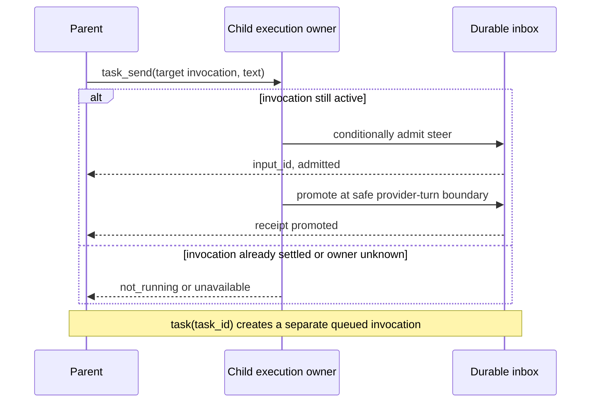
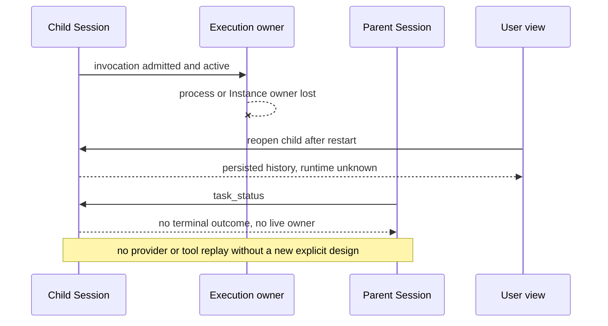

# RFC-0022：后台 Subagent 的执行生命周期与协作

## 状态与决策范围

**Draft。** 本文提出 OpenCode Transit 后台 subagent 从启动到终结的完整产品契约。它不宣称这些能力已经实现，也不授权修改运行时、用户配置或现有 Session。设计任务为 [#558](https://github.com/hammershock/opencode-transit/issues/558)。RFC 接受后按独立 issue 交付；此前不能把本文当作可用功能说明。

[Draft RFC-0015 / PR #437](https://github.com/hammershock/opencode-transit/pull/437) 已提出父会话控制工具、调用身份、投递与等待的详细方案，但尚未接受，也未覆盖后台执行存活和本次实测的消失场景。本文将其控制面决策纳入更完整的生命周期，评审时应把 RFC-0015 草案与本 RFC 对照并关闭或改为指向本 RFC 的设计记录。两篇草案不能各自进入实施状态。已接受的 RFC-0014、0016、0018、0021 仍分别约束 economics、可调用 Agent、执行位置和权限；本文不替代它们。

## 1. 问题、证据与功能参照

### 1.1 Transit 实测

在 `opencode-transit 1.18.30-transit.0+892eb4f6a82b` 的父 Session `ses_f309a143cffeiS289ExKh1hedy` 中，`task(background=true)` 创建了 child `ses_f30819ee7ffenmmlF1wenl6GQl`。父 Agent 可以继续与用户聊天。子会话持久记录含一条 user、一条 assistant、文本和两个工具调用；其中 `bash` 完成，`glob` 自 2026-09-24 02:19:22 本地时间起最后记录为 `running`。用户进入子会话时看到空白，父 Agent 无内置状态或中断工具，只能查询生产数据库。之后一次 `task(task_id=...)` 返回“Additional context sent”，但实现的 `BackgroundJob.extend` 将新执行排在前次执行结束之后；该回复不能证明正在运行的 child 已收到 steer。

用户还观察到后台 child 随后停止。现存持久记录没有 child 的完成、失败或取消结算，不能从这份记录判定它是退出、被取消、实例释放，还是执行 owner 丢失。**缺少可归因的终结或 owner-loss 状态，本身就是需要修复的故障。** 本 RFC 要求这些情况可区分、可检查；不把旧的 `running` part 当作当前存活证明，也不在缺乏证据时宣称 `glob` 绝对路径是根因。

当前 `BackgroundJob` 注册表依附于进程内 InstanceState，进程/实例 scope 关闭会失去运行时所有权；Session 文本与工具 part 仍可持久保留。已有 `SessionRunState.cancel`、Session 删除和用户显式停止还可能按各自契约中断子任务。后续诊断须区分这些路径，不能把“父 Agent 的一次回复结束”默认为 child 应终止。

### 1.2 Codex 功能参照

本文只参照本次 Codex harness 可见的 `spawn_agent`、`list_agents`、`send_message`、`followup_task`、`wait_agent`、`interrupt_agent` 语义以及[官方 OpenAI Docs 的 multi-agent 用户行为](https://developers.openai.com/api/docs/guides/agents-api/multi-agent)；不分析 Codex 源码，也不假设其内部存储、调度或故障恢复机制。可观察的基准是：父 Agent 启动独立工作后继续响应用户；可列出子任务并获知状态；可向正在工作的子 Agent 传消息、提交后续任务、等待消息或终结、显式中断；子 Agent 完成后父 Agent 得到有归属的结果。创建动作完成不等于子 Agent 完成。

Transit 不需要复制 Codex 的工具名、Agent 拓扑、默认并发数或服务架构；应实现上述用户可验证的行为，并遵守 Transit 现有 Session、Location、权限、同步及上游兼容边界。

| 用户行为                      | 本次 Transit 状态                | 本 RFC 的目标                                  |
| ----------------------------- | -------------------------------- | ---------------------------------------------- |
| 后台启动后继续与父 Agent 对话 | 可用                             | 保持；父回复、导航、TUI 重连不应静默停止 child |
| 看见 child 的当前状态和记录   | 空白视图与旧 `running` part 并存 | 展示持久历史、当前执行观测和观测时间           |
| 发送运行中补充信息            | `task_id` 被排在原执行之后       | active-only steer，有接纳与晋升回执            |
| 提交下一项工作                | 与 steer 混用                    | 明确的 queued follow-up，独立调用身份          |
| 等待或打断                    | 父 Agent 无专用工具              | 有界事件等待和精确中断                         |
| 获知完成或消失                | 仅承诺完成通知；缺失终态         | 结果幂等交付，owner 丢失可诊断，不伪报完成     |

### 1.3 目标与非目标

目标是让用户和父 Agent 在不查数据库、不轮询 shell 的情况下完成一次真实后台委派：启动、并行互动、查看活动、补充指令、等待、终止、接收结果、识别故障和继续工作。子 Session 的实际执行位置、权限和身份必须可解释，结果与故障不能因切换页面或重连而消失。

本 RFC 不提供任意 Agent 间聊天、跨 root 控制、集群执行器、自动重试 provider/工具副作用、自动接管孤儿任务、强制杀死远端 OS 进程、持久训练作业调度，或给所有文件工具统一设定超时。后台 Agent 的可用性仍由明确的实验开关控制，且不因本 RFC 被接受而默认开启。

## 2. 身份、所有权与权限

- **Child Session ID** 标识可复用的子会话及其历史；**Task invocation** 标识一次具体委派，由父 Session、父 assistant message、Task call ID 和对应 child input ID 关联。一次 `task_id` follow-up 是新的 invocation，不覆盖前一次结果。Session drain 或进程内 job 不是持久调用身份。
- 由 Session input/execution owner 拥有接纳、晋升、执行和中断；Task 及控制工具只通过该 owner 操作，不建立另一套 durable job queue。legacy Task 可以经兼容 adapter 逐步接入，但同一动作不能存在两套互相矛盾的状态真值。
- 父 Agent 只能列出、发送、等待和中断自己当前父 Session 直接委派且仍被允许控制的 child。知道 ID 不构成权限。用户的 TUI 可在其现有 Session 访问范围内查看和控制；嵌套委派由实际直接父 Session 控制。所有新工具在 catalog 与执行 leaf 双重检查权限，不能绕过 child 的 deny、Location policy 或用户批准。
- Child 保留自身 Location；目标选择及校验遵守 RFC-0018。控制操作按 child 的实际 Location/owner 路由，远端不可达时报告不可用，不回退到本机。Agent 定义、模型、经济信息和访问状态分别沿用 RFC-0014/0016；控制消息不提升为用户授权或系统指令。
- 并发限制、深度限制和资源预算是显式配置/策略；达到上限时在创建前拒绝或明确标为 `queued_capacity`，不得返回“已运行”。v1 推荐保留现有并发行为并先实现准确状态，后续再增加可配置配额；不从 Codex 猜一个默认数字。

## 3. 生命周期和真实性

### 3.1 状态分层

API 返回结构化 `TaskView`，至少含 `task_id`、`invocation`、description、agent、Location 非敏感摘要、`lifecycle`、`outcome?`、`runtime`、`phase`、`cancellation`、`observed_at`、`last_progress_at?`、当前工具的名称/调用 ID/开始时间、结果引用与截断摘要。列表可分页且有界，不能返回原始命令参数、凭据或无限 transcript。

建议的公共形状如下；字段名与 wire 编码在实施前由 Schema/Protocol 契约固定。`result` 的摘要限 2 KiB UTF-8，完整内容仍经既有 Session 内容权限读取。

```ts
type TaskTarget = {
  task_id: string
  invocation?: {
    parent_session_id: string
    parent_message_id: string
    call_id: string
  }
}

type TaskView = {
  target: TaskTarget
  description: string
  agent_id: string
  location: { target_id?: string; target_name?: string; directory?: string }
  lifecycle: "admitted" | "active" | "settled" | "unscoped_legacy"
  outcome?: "completed" | "failed" | "cancelled"
  runtime: "observed" | "unknown" | "unavailable"
  phase: "queued" | "model" | "tool" | "permission" | "question" | "unknown"
  cancellation: "none" | "requested" | "observed"
  observed_at: number
  last_progress_at?: number
  active_tool?: { name: string; call_id: string; started_at?: number }
  result?: { message_id?: string; summary?: string; truncated: boolean }
}
```

`location.directory` 只对已有权限查看 child Location 的用户/父 Agent 返回；通用列表和同步摘要可省略。`observed_at` 是读取时间，不能用它刷新 `last_progress_at`。旧记录缺少 invocation 时标为 `unscoped_legacy`，不能成为精确 steer 或 interrupt 的目标。

| 维度           | 值与含义                                                                                   |
| -------------- | ------------------------------------------------------------------------------------------ |
| `lifecycle`    | `admitted`、`active`、`settled`、`unscoped_legacy`；来自持久输入/调用关联                  |
| `outcome`      | 仅确切终结时为 `completed`、`failed` 或 `cancelled`                                        |
| `runtime`      | `observed`、`unknown`、`unavailable`；仅表示本次查询能否确认适用执行 owner，不保证 OS 健康 |
| `phase`        | `queued`、`model`、`tool`、`permission`、`question`、`unknown`；仅由真实事件推导           |
| `cancellation` | `none`、`requested`、`observed`；请求中断不等于已终结                                      |

旧 `running` part 只证明工具调用曾开始。进程退出、Instance scope 释放、连接断开、TUI 重连、超时和没有新文本，都不能自动投影为 `completed` 或 `cancelled`。执行 owner 的存活观测和 Session 的持久结算须分别携带来源与时间。若 owner 已失而持久调用未结算，显示 `active + runtime: unknown` 或有明确失败证据的 `unavailable`，UI 写“运行状态未知/执行连接不可用”，不能继续显示无条件旋转的“正在工作”。读取此状态不会自动恢复 provider 调用。

一次 Task invocation 最多有一个不可逆的 terminal outcome。完成与中断竞争时，以执行 owner 已确认并持久提交的先到终结事实为准；重复事件幂等。子 Session 结束一次调用后仍可接纳明确的新 follow-up，不因一次取消而永久删除。

### 3.2 后台存活边界

后台子任务的生命周期独立于父 Agent 单次 provider turn、父 Session 当前是否 idle、TUI 选中页面、普通重连和客户端的视图卸载。Task start 返回后，执行 owner 保持在明确的服务/会话生命周期中；不能靠某个 HTTP 请求、渲染组件或临时调用 scope 隐含持有。程序正常退出时执行受控 shutdown：停止接纳新调用，尽力中断当前工作并提交能确认的结算；来不及确认的调用保留非终态并在下次启动呈现 unknown。非正常退出也遵守相同的读时解释。

明确的父 Session 用户停止、child 中断、Session 删除、应用退出各有独立契约。普通父回复不触发递归取消；用户停止整个父 Session 时是否递归中断其直接/间接 child，沿用现有显式停止行为并在 UI 显示受影响范围。Task 的 foreground 取消保持现有调用所有权；后台中断必须走指定 invocation。删除与同步 tombstone 的 barrier 优先，不能让迟到结果通知复活已删除父 Session。

v1 不承诺 child 在应用退出后继续运行。若用户需求是真正跨进程持续执行，应另立具备 durable ownership、外部副作用对账和恢复策略的 RFC；本 RFC 只要求重启后准确报告未结算状态、保存已发生的消息，并提供用户主动检查或新建调用的途径。不得仅凭旧输入自动重放模型或工具。

## 4. 父子互动契约

### 4.1 保留 Task 创建，拆分控制动作

保留现有 `task` 参数、foreground 默认值、实验性 `background=true` 和 `task_id` 复用入口。在本控制能力启用后，`task(task_id=...)` 明确提交**下一项** follow-up，产生新的 invocation，并以 Session 的 `queue` 方式等待当前调用到安全空闲边界。未知、非直属或已删除 ID 直接报错，不能静默新建 child。用户可在一个父 Session 中继续正常聊天、启动其他独立 child；父模型不会因某个 child 工具等待而卡住。

新增下列语义，名称为本 RFC 的提议，接受前不视为已发布 API：

| 工具             | 作用                                            | 关键保证                                        |
| ---------------- | ----------------------------------------------- | ----------------------------------------------- |
| `task_status`    | 列出直属 child 或查询指定 invocation 及有界结果 | 只读、可分页、状态有来源和新鲜度                |
| `task_send`      | 向**正在执行的指定 invocation** 补充信息        | 返回接纳回执；idle/unknown 时拒绝；不启动下一轮 |
| `task_wait`      | 等待指定任务的终结、重要变化或用户输入          | 有界事件等待；取消等待不取消 child              |
| `task_interrupt` | 请求中断指定 invocation                         | 校验预期调用；不误伤新的 follow-up              |

模型工具、TUI 和 Server/Client 消费同一控制服务和状态 schema。TUI 可以提供“查看、补充、等待、停止”的用户入口；其操作遵守用户本身的权限，不伪装成 Agent 工具调用。

`task_status` 无目标时分页列出直属 child 的最新 invocation，目标查询最多 32 项；结果列表按持久委派顺序而非轮询时间排序。`include_results` 默认为 false。显式目标必须全部校验授权后再返回；未知与无权使用相同外部错误，避免枚举 Session。跨页使用固定枚举上界的 opaque cursor，新任务不插入旧分页。查询是只读的，不消费结果或通知。

### 4.2 Steer、follow-up 与回执

`task_send` 仅对当前明确 active 的 invocation 做条件接纳，使用 Session durable inbox 的 `steer` delivery，在该 child 下一个安全 provider-turn 边界晋升。它的返回值为 `input_id` 和 `state: admitted`，**不写“已送达模型”**。`task_status` 可以用同一 `input_id` 查询 `admitted`、`promoted` 或 `not_delivered(reason)`。若完成/取消抢先发生，输入变为 `not_delivered`，不能泄漏到下次 follow-up，也不单独唤醒 idle child。重复相同调用幂等，冲突重用失败。

`task(task_id=...)` 是独立 queued follow-up。原 invocation 被工具阻塞时，它可以被持久接纳，但返回必须说“已排队”，不能说“运行中的 child 已收到”。两个 follow-up 按确定顺序晋升，分别保有结果和通知；单个 background job 的最后一个输出不能覆盖前面的调用。父 Agent 的指令是任务数据，不能改变用户授权、子 Agent 权限或项目指令。用户可见的 steer 也需标明来源和送达状态。



### 4.3 等待与中断

`task_wait` 指定最多 32 个已授权 invocation；默认等终结，可选择有意义的状态变化。等待上限默认 30 秒、最高 120 秒；超时返回 `timed_out=true`，不影响 child。已完成目标立即返回，订阅与快照协调避免丢失完成事件。权限/问题、owner 不可用、父用户新输入均可提前唤醒；父用户输入可中断等待而继续父会话，不能因此误取消 child。反复轮询同一状态不是推荐 Agent 路径。

`task_interrupt` 对已结算调用返回 `already_settled`；对未晋升的 follow-up 取消其 input；对 active 调用在执行 owner 内校验预期 invocation 后返回 `requested`，最终由结算事件确认。owner 不可用返回 `unavailable`，不把意图写成成功取消。同一 child 正执行下一项任务时，对旧 invocation 的请求不能取消新工作。系统尽力传播 AbortSignal 并释放所拥有的工具/子进程；若原生 I/O 或外部作业不可撤销，结果不得宣称已回滚其副作用。中断当前调用不自动删除 child Session，也不暗中清空其他已排队 follow-up；UI 显示余下队列。

控制操作至少区分 `unknown_or_forbidden`、`invocation_conflict`、`not_running`、`unavailable` 和真正已结算结果；`task_wait` 另有 `terminal`、`state_changed`、`needs_input`、`parent_input`、`timeout` 返回原因。错误不得退化为一条泛化的 “Task cancelled”，也不得把进程失联变成可安全重试的授权。状态读取可以返回有界的最近结果，不能因此启动模型或改变 child 状态。

## 5. 结果、通知和父 Session 接续

每个 invocation 以关联 child input 的唯一终结事实确定结果，保存结果 message 引用和有界摘要。后台 Task 工具返回 `running` 仅表示启动/接纳，不是工作完成。前台调用仍通过原工具结果返回，不重复注入同一内容。

后台 `completed/failed/cancelled` 在父 Session 中产生一个有来源标识的 durable delegation-result 输入，关联 task ID、invocation 和结算身份；重试不得重复生成。投递须与父 Session 删除屏障协调，不能向已删除或同步 tombstoned 的父会话写入通知。子输出不能冒充用户消息或系统指令，仍按工具结果的非可信内容处理。结果投递生产者不等待父模型执行，避免与 `task_wait` 构成循环等待。

父正在执行或等待时，结果事件使等待结束并在既有安全边界成为父 Agent 可见输入。父已 idle、用户明确停止或程序刚重启时，完成状态及人类 TUI 通知仍可查看，但不擅自启动新的父模型请求；下一次用户或 Agent 明确继续时再消费该输入。TUI toast、父模型输入和系统即时通知是不同通道，分别说明是否实际投递。通知失败可重试，幂等键保证不会重复唤醒或重复计费。普通进度默认只在状态/TUI 展示，不因每条进度自动调用父模型。

## 6. TUI、CLI 与观测

- 父 Session 的 Task 卡显示 child 名称、实际 Location、当前 invocation 状态、最后观测时间和可进入的 child 入口；存在其他活跃 child 时给出可见指示，不强行改变焦点。
- Child 页面先加载持久历史再订阅实时事件。若消息已在库中，不能显示完全空白且没有加载/错误说明；重连后须与权威快照对账。当前 invocation 与更早历史有明确边界，恢复 `task_id` 不把旧文本当作新进度。
- 当前工具只展示名称、开始时间、已观测持续时长和最近事件时间；长时间无事件显示“上次观测于…”，不能推断卡死、模型仍在思考或文件扫描百分比。权限/问题采用现有交互通道。完成、失败、取消、owner unknown 使用不同标识和可展开原因。
- Full TUI、`run`/mini 和 Server/Client 对同一 Task 状态得出相同结论；终端布局可不同。视图不直接查数据库。列表和摘要有界，隐藏原始工具参数、私密路径、凭据和不属于调用者的 Session 内容。
- 对实验开关关闭或旧服务端，控制工具与按钮不出现或报告明确的 capability unavailable；旧 transcript 保持可读，无法归属的历史标为 `unscoped_legacy`，不得伪造精确当前状态。

## 7. 持久化、兼容和故障处理

Session 继续拥有输入、消息、调用关联和终结事实；BackgroundJob 可作为执行中的临时调度部件，不能作为重启后的唯一状态来源。读路径从持久事实加当前执行 owner 观测构造视图。既有 legacy Task 的 `task_id` 和历史记录继续可读；新字段可选且版本化，迁移不得把历史 `running` 一概改成 cancelled/failed。若需要新的 public Protocol/HttpApi 字段，按仓库规则生成 Client/SDK，不能直接编辑生成文件。

进程或 Instance generation 更换时，旧 owner token 失效；新进程可识别并显示未结算调用，但不能默默接管和重复执行。远端 Rexd 断线分离 controller 观测失败与 target 侧执行是否结束；不触发本机 fallback。多设备 Session sync 可以传输持久消息/结果，但运行时 owner、设备局部状态和凭据不随 sync 复制；另一设备不得声称自己正在执行或自动中断原设备的 child。删除采用 RFC-0010 的 remove-wins 规则。

对工具长时间未结算，首先提供准确可见的已运行时间、owner 新鲜度和显式中断。具体文件工具的 pattern 校验、搜索根约束或期限策略须由独立 bug/feature issue 根据可复现证据制定，不能用全局自动超时掩盖底层问题。



## 8. 实施切分和依赖

本 RFC 接受后分别创建符合 fork Ready 契约的 issue；每项各用一条 semantic branch、worktree 和 PR。推荐顺序：

1. **执行 owner 与异常消失修复**：复现父回复、页面切换、Instance dispose、进程退出和显式停止；修复不应终止的路径，建立 owner loss 可诊断事实。复用已合并的取消与调用关联修复，不重做 #429/#430/#433。
2. **统一 Task 视图**：从 invocation/Session 结算及当前 owner 派生状态、结果和新鲜度；提供只读 `task_status` 与 TUI/CLI 一致投影。已计划的 [#431](https://github.com/hammershock/opencode-transit/issues/431) 视觉工作依赖此契约或与它明确协作。
3. **输入语义**：active-only `task_send` 与 receipt；`task_id` queued follow-up 的独立身份和防错投递。
4. **等待和中断**：`task_wait` 的无丢唤醒订阅，`task_interrupt` 的精确 owner 校验与队列保留。
5. **结果通知与恢复**：幂等父输入、删除屏障、idle/重启处理；完整 TUI、mini/run 验收。

其中可独立复现的“子会话已有消息却显示空白”和“后台 job 被意外停止”应作为 bug issue 尽早诊断与修复；不必等全部新控制工具落地，但不能在修复中偷偷改变本 RFC 尚未接受的产品语义。RFC-0018 的跨 Target Task 交付按其自身 issue 推进；本 RFC 的控制面在该能力出现时必须读取 child 的真实 Location。

## 9. 验收场景与风险选择

| 场景                                                                  | 必须观察到的结果                                                                    |
| --------------------------------------------------------------------- | ----------------------------------------------------------------------------------- |
| 启动后台 child，父 Agent 连续回答三条用户输入并切换 child/parent 页面 | child 继续执行；两边记录可见且身份不串；父回复不暗中取消 child                      |
| child 的一个文件工具可控地阻塞，另一个并行工具完成                    | 状态指出已完成工具和仍在运行工具；无输出不被报为完成；页面不空白                    |
| 阻塞期间 `task_send`，随后取消或释放工具                              | 回执先为 admitted，晋升后为 promoted；若任务先结束则 not_delivered，绝不谎称已消费  |
| 同一 child 运行中提交两个 `task_id` follow-up                         | 均为 queued，按序晋升，各有独立 invocation 和结果；当前调用不接收下一项指令         |
| 父 Agent `task_wait` 期间用户发消息                                   | wait 返回 parent_input，父继续处理；child 不受影响                                  |
| 对当前/旧调用中断，并与完成事件竞争                                   | 精确调用只结算一次；旧调用的中断不影响新调用；外部副作用不被虚报回滚                |
| child 完成、失败、取消，父处于执行、idle、用户停止三种状态            | 每次一个有归属的结果；TUI 可见；仅合适的执行边界继续父模型                          |
| 父/child 所在 Instance dispose、程序正常/异常退出后重启               | 无终态任务呈 unknown/unavailable；历史保留，无自动 provider/tool 重放，无永久假旋转 |
| 远端 child 断连、重新连接、target 失效                                | 状态来源和错误准确，控制按真实 Location 路由，不回退本机                            |
| 父 Session 删除与迟到结果并发                                         | 无通知复活或跨设备重现；不向无权调用者泄漏内容                                      |

测试先用可控 Deferred、临时数据库与隔离目录证明状态竞态和取消传播，再从精确 PR head 建立 clean Mac candidate，并实测完整 TUI 与 `run`/mini。TUI 变化需截图或录屏；执行/通知/恢复需脱敏日志。跨 Target 控制或断线行为需要真实 Rexd 目标；多设备同步/删除边界变化按 `docs/testing-workflow.md` 选择双设备验收。不能用 Mac 成功推断 WSL2 通过，也不能用进程内模拟证明重启恢复。生产 Session 只作只读诊断，不用于破坏性测试。

## 待评审的产品选择

1. 本 RFC 取代未接受的 RFC-0015 控制草案作为后台执行总契约；保持其中的四个控制工具方向，RFC-0015 不再独立实施。
2. v1 后台存活范围为当前应用服务生命周期；退出后未结算工作显示 unknown，禁止自动重放。真正跨进程继续工作另立 RFC。
3. 父 Agent 仅控制直属 child；用户 TUI 仍按已有 Session 访问范围操作。
4. `task_send` 是 active-only steer，`task(task_id=...)` 是 queued follow-up，二者回执不得混用。
5. 终结结果持久、幂等；父 idle、用户停止或重启后仅人类可见，不擅自启动父模型。
6. 精确中断当前 invocation 后，其他已排队 follow-up 保留；停止整个工作组需要显式范围操作或逐项取消。

接受这些选择后才能把后续实现 issue 标为 Ready；如果评审改变任一项，应先更新本 RFC 的状态机、验收场景和与 RFC-0015 的关系。
