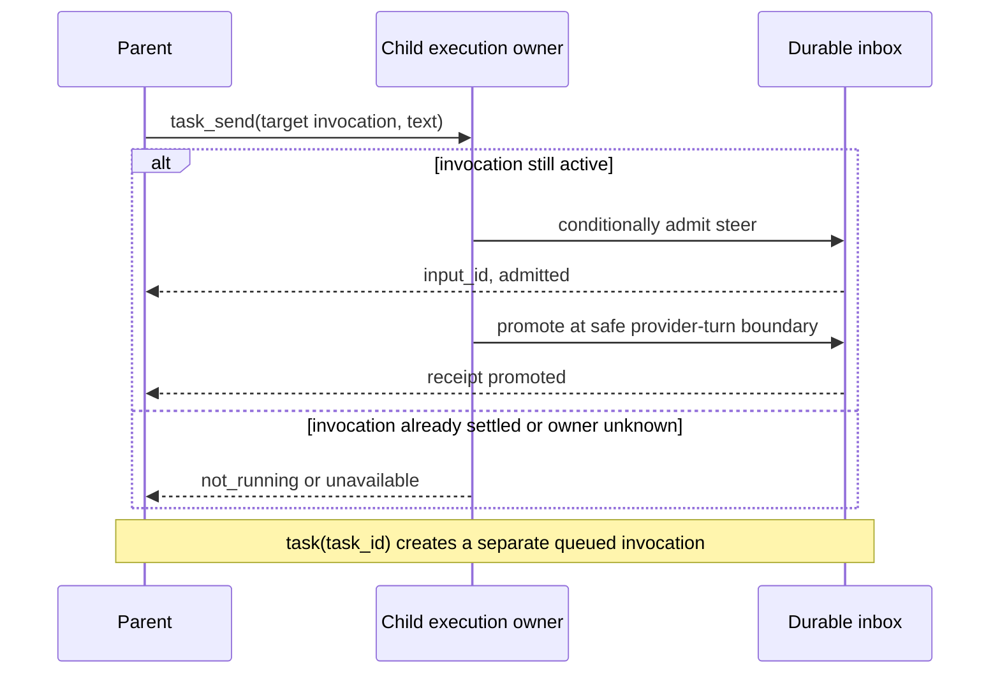
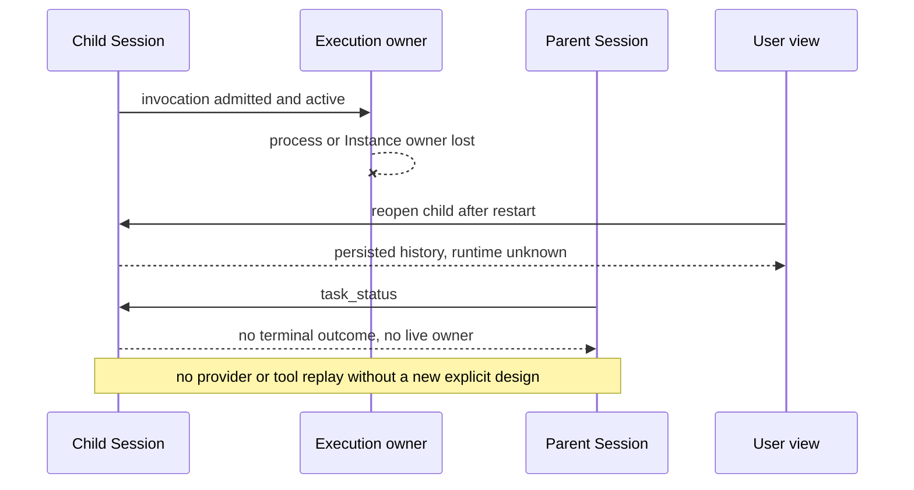

# RFC-0023：后台 Subagent 的执行生命周期与协作

## 状态与决策范围

**Draft。** 本文提出 OpenCode Transit 后台 subagent 从启动到终结的完整产品契约。它不宣称这些能力已经实现，也不授权修改运行时、用户配置或现有 Session。设计任务为 [#558](https://github.com/hammershock/opencode-transit/issues/558)。RFC 接受后按独立 issue 交付；此前不能把本文当作可用功能说明。

[Draft RFC-0015 / PR #437](https://github.com/hammershock/opencode-transit/pull/437) 已提出父会话控制工具、调用身份、投递与等待的详细方案，但尚未接受，也未覆盖后台执行存活和本次实测的消失场景。本文将其控制面决策纳入更完整的生命周期，评审时应把 RFC-0015 草案与本 RFC 对照并关闭或改为指向本 RFC 的设计记录。两篇草案不能各自进入实施状态。已接受的 RFC-0014、0016、0018、0021 仍分别约束 economics、可调用 Agent、执行位置和权限；本文不替代它们。

## 1. 问题、证据与功能参照

### 1.1 Transit 实测

在 `opencode-transit 1.18.30-transit.0+892eb4f6a82b` 的父 Session `ses_f309a143cffeiS289ExKh1hedy` 中，`task(background=true)` 创建了 child `ses_f30819ee7ffenmmlF1wenl6GQl`。父 Agent 可以继续与用户聊天。子会话持久记录含一条 user、一条 assistant、文本和两个工具调用；其中 `bash` 完成，`glob` 自 2026-09-24 02:19:22 本地时间起最后记录为 `running`。用户进入子会话时看到空白，父 Agent 无内置状态或中断工具，只能查询生产数据库。之后一次 `task(task_id=...)` 返回“Additional context sent”，但实现的 `BackgroundJob.extend` 将新执行排在前次执行结束之后；该回复不能证明正在运行的 child 已收到 steer。

用户当时还观察到后台 child 似乎停止；当时读取的持久记录没有 child 的完成、失败或取消结算，无法判断执行 owner 状态。该 child 后来产生了完成通知，因此不能再把这一段记录当作永久终止的证据。**长时间没有新输出时缺少可归因的状态，本身仍是需要修复的故障。** 本 RFC 要求执行中、失联和已结算可区分、可检查；不把旧的 `running` part 当作当前存活证明，也不在缺乏证据时宣称 `glob` 绝对路径是根因。

在 `1.18.30-transit.0+9e9a682b5f55` 的同一父 Session 中，随后两次 `task(task_id=...)` 实验补充了时间证据。长任务的父 Task 工具在 child 启动约 1.6 秒后返回“Additional context sent”；child 连续执行一个包含 12 次 sleep 的 bash 调用，约 183 秒后才把补充内容写成下一条 user 消息。第二次实验将六次 sleep 分成六个独立的 bash 工具调用：父 Task 工具在 child 启动约 1.5 秒与 32 秒时分别返回“updated”，child 却在第六次工具调用和最终回答之后、约 67 秒与 70 秒时才记录两条补充输入。由父工具调用时间和 child 消息时间共同可见：**当前 `task_id` 入口是排队续接，不能宣称补充消息已在下一次工具调用或 provider turn 被消费。** child 对何时“看见”文本的自述仅作辅助证据。

这段会话还要求父 Agent 能在运行中打断 child、询问已做进展并使其继续。目前父 Agent 没有对应控制工具；不能靠提示 child 分段执行来代替产品能力。用户能只读进入 child 历史，但父 Agent 没有同等的内置状态/进度入口，也不能把“提交了消息”误报为“child 已收到”。

同版本另有一次独立的真实会话验收：父 Session 在 child 的 `sleep 50` 期间继续答复，排队补充指令随后得到处理，child 的七条消息可经 Session API 和 mini TUI 历史回放查看，并收到了完成通知。它验证了已修复的持久记录显示与基本后台生命周期，但没有覆盖中断、进程崩溃或运行中 steer。

当前 `BackgroundJob` 注册表依附于进程内 InstanceState，进程/实例 scope 关闭会失去运行时所有权；Session 文本与工具 part 仍可持久保留。已有 `SessionRunState.cancel`、Session 删除和用户显式停止还可能按各自契约中断子任务。后续诊断须区分这些路径，不能把“父 Agent 的一次回复结束”默认为 child 应终止。

### 1.2 Codex 功能参照

本文只参照本次 Codex harness 可见的 `spawn_agent`、`list_agents`、`send_message`、`followup_task`、`wait_agent`、`interrupt_agent` 语义以及[官方 OpenAI Docs 的 multi-agent 用户行为](https://developers.openai.com/api/docs/guides/agents-api/multi-agent)；不分析 Codex 源码，也不假设其内部存储、调度或故障恢复机制。可观察的基准是：父 Agent 启动独立工作后继续响应用户；可列出子任务并获知状态；可向正在工作的子 Agent 传消息、提交后续任务、等待消息或终结、显式中断；子 Agent 完成后父 Agent 得到有归属的结果。创建动作完成不等于子 Agent 完成。

Transit 不需要复制 Codex 的工具名、Agent 拓扑、默认并发数或服务架构；应实现上述用户可验证的行为，并遵守 Transit 现有 Session、Location、权限、同步及上游兼容边界。

| 用户行为                      | 本次 Transit 状态                  | 本 RFC 的目标                                  |
| ----------------------------- | ---------------------------------- | ---------------------------------------------- |
| 后台启动后继续与父 Agent 对话 | 可用                               | 保持；父回复、导航、TUI 重连不应静默停止 child |
| 看见 child 的当前状态和记录   | 历史空白已修复；父视图缺少权威状态 | 展示持久历史、当前执行观测和观测时间           |
| 发送运行中补充信息            | `task_id` 被排在原执行之后         | active-only steer，有接纳与晋升回执            |
| 提交下一项工作                | 与 steer 混用                      | 明确的 queued follow-up，独立调用身份          |
| 等待、打断、询问后继续        | 父 Agent 无专用工具                | 有界事件等待、精确中断、保留子会话并显式续接   |
| 获知完成或消失                | 完成通知可用；失联时缺少归因状态   | 结果幂等交付，owner 丢失可诊断，不伪报完成     |

### 1.3 目标与非目标

目标是让用户和父 Agent 在不查数据库、不轮询 shell 的情况下完成一次真实后台委派：启动、并行互动、查看活动、补充指令、等待、终止、接收结果、识别故障和继续工作。子 Session 的实际执行位置、权限和身份必须可解释，结果与故障不能因切换页面或重连而消失。

本 RFC 不提供任意 Agent 间聊天、跨 root 控制、集群执行器、自动重试 provider/工具副作用、自动接管孤儿任务、强制杀死远端 OS 进程、持久训练作业调度，或给所有文件工具统一设定超时。后台 Agent 的可用性仍由明确的实验开关控制，且不因本 RFC 被接受而默认开启。

## 2. 身份、所有权与权限

- **Child Session ID** 标识可复用的子会话及其历史；**Task invocation** 标识一次具体委派，由父 Session、父 assistant message、Task call ID 和对应 child input ID 关联。一次 `task_id` follow-up 是新的 invocation，不覆盖前一次结果。Session drain 或进程内 job 不是持久调用身份。
- 由 Session input/execution owner 拥有接纳、晋升、执行和中断；Task 及控制工具只通过该 owner 操作，不建立另一套 durable job queue。legacy Task 可以经兼容 adapter 逐步接入，但同一动作不能存在两套互相矛盾的状态真值。
- 父 Agent 只能列出、发送、等待和中断自己当前父 Session 直接委派且仍被允许控制的 child。知道 ID 不构成权限。用户的 TUI 可在其现有 Session 访问范围内查看和控制；嵌套委派由实际直接父 Session 控制。所有新工具在 catalog 与执行 leaf 双重检查权限，不能绕过 child 的 deny、Location policy 或用户批准。
- Child 保留自身 Location；目标选择及校验遵守 RFC-0018。控制机上的 Session execution owner 与 Rexd 工作区执行能力分别判断：持久状态/结果查询及本地 durable pending 取消无需 Rexd 连通；当前控制进程仍持有 owner 时可请求中断其执行链，但须单独报告远端进程停止是否得到确认；依赖目标执行能力的新调用按现有 Location 策略拒绝。所有分支都不得本机 fallback，也不把 target ID 当成 owner 身份。Agent 定义、模型、经济信息和访问状态分别沿用 RFC-0014/0016；控制消息不提升为用户授权或系统指令。
- v1 对一个 root 委派树设有限 active 配额：最多 8 个 invocation，计入所有代际正在执行、等待权限/问题/子任务结果的调用，以及 owner unknown 且尚未管理性归档的调用；持久 pending 不占 active 配额。新 child 或 idle child 的新调用须在 root 范围原子取得额度，已满即在接纳前返回含当前用量与上限的 `capacity_exceeded`，不形成 capacity queue。仅已持有 active 额度的 child 可接纳后续 follow-up 为 pending；每个 child 最多 16 项、每个 root 最多 64 项，满额时接纳前拒绝。前一调用结算、后一 eligible input 晋升时在同一 root 串行边界转移额度；无额度时不得晋升，已接纳输入保留可见并返回 `capacity_unavailable`，不暗中轮询启动。不同 child 不能各自读计数后同时超额晋升。等待子任务的祖先继续占额度；额度不足时子委派立即失败，`task_wait` 保持有界，不能形成隐式无限等待。管理性归档 unknown 可释放**策略额度**，不证明外部资源已停止。限额与用量在 API 返回；不引入独立的 `queued_capacity` 调度器，也不返回“已运行”。已有深度限制与经济预算仍分别生效。

root 任一 invocation 结算或管理性 disposition 释放额度时，在同一串行边界按持久接纳顺序重新评估各 child 的队首 eligible pending；只有仍有适用 live owner、Location 可执行且成功取得额度者才晋升。frozen input 不会因额度释放而自动变为 eligible，也不能被同一 child 的后续输入越过；若无可晋升项就停止评估，等待下一次明确的结算、处置或恢复操作事件，不使用后台轮询或冷恢复自动执行。

## 3. 生命周期和真实性

### 3.1 状态分层

API 返回结构化 `TaskView`，至少含 `task_id`、`invocation`、description、agent、Location 非敏感摘要、`lifecycle`、`outcome?`、`runtime`、`phase`、`cancellation`、观测来源/代际/时间、`last_progress_at?`、有界当前工具列表与总数、结果引用与截断摘要。列表可分页且有界，不能返回原始命令参数、凭据或无限 transcript。

建议的公共形状如下；字段名与 wire 编码在实施前由 Schema/Protocol 契约固定。`result` 的摘要限 2 KiB UTF-8，完整内容仍经既有 Session 内容权限读取。

```ts
type TaskTarget = {
  task_id: string
  invocation?: {
    parent_session_id: string
    parent_message_id: string
    call_id: string
  }
}

type TaskView = {
  target: TaskTarget
  description: string
  agent_id: string
  location: { target_id?: string; target_name?: string; directory?: string }
  lifecycle: "admitted" | "active" | "settled" | "unscoped_legacy"
  outcome?: "completed" | "failed" | "cancelled"
  runtime: "observed" | "unknown" | "unavailable"
  phase: "queued" | "model" | "tool" | "permission" | "question" | "unknown"
  cancellation: "none" | "requested" | "observed"
  lifecycle_source: "durable" | "legacy_projection"
  runtime_observation?: { source: "execution_owner"; owner_generation: string; observed_at: number }
  read_at: number
  last_progress_at?: number
  active_tools: { name: string; call_id: string; started_at?: number }[]
  active_tool_count: number
  active_invocation?: TaskTarget["invocation"]
  queued_count: number
  result?: { message_id?: string; summary?: string; truncated: boolean }
}
```

`location.directory` 只对已有权限查看 child Location 的用户/父 Agent 返回；通用列表和同步摘要可省略。`read_at` 是本次读取时间；`runtime_observation.observed_at` 是 owner 实际观测时间，读取缓存不能刷新它，也不能刷新 `last_progress_at`。`owner_generation` 只在当前进程内比较，不能同步；对外只暴露不含进程秘密的代际摘要。`active_tools` 有界、按调用 ID 去重，`active_tool_count` 是未截断总数；已完成工具经有界近期事件另行展示。旧记录缺少 invocation 时标为 `unscoped_legacy`，不能成为精确 steer 或 interrupt 的目标。

| 维度           | 值与含义                                                                                   |
| -------------- | ------------------------------------------------------------------------------------------ |
| `lifecycle`    | `admitted`、`active`、`settled`、`unscoped_legacy`；来自持久输入/调用关联                  |
| `outcome`      | 仅确切终结时为 `completed`、`failed` 或 `cancelled`                                        |
| `runtime`      | `observed`、`unknown`、`unavailable`；仅表示本次查询能否确认适用执行 owner，不保证 OS 健康 |
| `phase`        | `queued`、`model`、`tool`、`permission`、`question`、`unknown`；仅由真实事件推导           |
| `cancellation` | `none`、`requested`、`observed`；请求中断不等于已终结                                      |

旧 `running` part 只证明工具调用曾开始。进程退出、Instance scope 释放、连接断开、TUI 重连、超时和没有新文本，都不能自动投影为 `completed` 或 `cancelled`。执行 owner 的存活观测和 Session 的持久结算须分别携带来源与时间。若 owner 已失而持久调用未结算，显示 `active + runtime: unknown` 或有明确失败证据的 `unavailable`，UI 写“运行状态未知/执行连接不可用”，不能继续显示无条件旋转的“正在工作”。读取此状态不会自动恢复 provider 调用。

`promoted` 只证明输入进入持久历史并可构造上下文；不证明 provider 已接收、模型已理解或工具已执行。UI 不得标作“已读”；如需实际使用证据，关联后续 provider turn/context。

一次 Task invocation 最多有一个不可逆的 terminal outcome。完成与中断竞争时，以执行 owner 已确认并持久提交的先到终结事实为准；重复事件幂等。子 Session 结束一次调用后仍可接纳明确的新 follow-up，不因一次取消而永久删除。

### 3.2 后台存活边界

后台子任务的生命周期独立于父 Agent 单次 provider turn、父 Session 当前是否 idle、TUI 选中页面、普通重连和客户端的视图卸载。Task start 返回后，执行 owner 保持在明确的服务/会话生命周期中；不能靠某个 HTTP 请求、渲染组件或临时调用 scope 隐含持有。程序正常退出时执行受控 shutdown：停止接纳新调用，尽力中断当前工作并提交能确认的结算；来不及确认的调用保留非终态并在下次启动呈现 unknown。非正常退出也遵守相同的读时解释。

明确的父 Session 用户停止、child 中断、Session 删除、应用退出各有独立契约。普通父回复不触发递归取消；用户停止整个父 Session 时是否递归中断其直接/间接 child，沿用现有显式停止行为并在 UI 显示受影响范围。Task 的 foreground 取消保持现有调用所有权；后台中断必须走指定 invocation。删除与同步 tombstone 的 barrier 优先，不能让迟到结果通知复活已删除父 Session。

v1 不承诺 child 在应用退出后继续运行。若用户需求是真正跨进程持续执行，应另立具备 durable ownership、外部副作用对账和恢复策略的 RFC；本 RFC 只要求重启后准确报告未结算状态、保存已发生的消息，并提供用户主动检查或新建调用的途径。不得仅凭旧输入自动重放模型或工具。

委派输入有显式 execution eligibility。运行中 A 的 steer S 绑定 A 的 input 与 owner generation；A 失去 owner 后，S 转为 `not_delivered(owner_lost)`，不能混入新调用。A 之后已接纳的 queued B/C 保持可见但冻结；普通 wake 不晋升旧输入，新的询问 D 在 B/C 未处置或旧 owner 排他终止未确认时拒绝接纳。A 保持 `unknown`，不伪造失败/取消。只有控制机同设备的有序 shutdown 证据，或核实旧进程身份已退出且当前进程独占本地 Session 存储，才可确认旧本机 owner 已终止；Rexd 断线、另一控制机失联、owner token 更换或用户点击继续都不是证据。无法确认时，同一 child 的新执行持续拒绝；状态必须给出可操作的等待/处置原因。查询、sync 导入及 record-only 对账不调用模型。

`task_reconcile` 是同一控制服务的显式恢复入口。已授权的直属父 Agent 或有 child Session 访问权的用户可提交 `operation_id`、精确 child input/invocation 和 `resume_pending` 或 `cancel_pending`；只读 legacy 记录不可作为目标。`resume_pending` 在确认旧 owner 已终止、适用 Location revision 仍有效且 unknown A 已管理性归档后，将**原 input**从 frozen 改为 eligible，不创建第二个 invocation；`cancel_pending` 记录不可逆取消，不执行它。操作及 `{ input_id, invocation, disposition, eligibility, capacity_state }` receipt 持久化；精确重试返回同一处置，冲突复用失败。继续仍需在晋升时原子取得 root 额度，额度不足则原 input 保持 eligible 但不执行，返回 `capacity_unavailable`。用户可逐项处理 B/C，再提交 D；保留的 B/C 依原委派顺序执行。

用户经 TUI/typed API 可对精确 unknown invocation A 提交独立的 `archive_unknown` 管理操作及稳定 `operation_id`。它记录 `abandoned_unknown` disposition、操作者、时间和未确认外部副作用的提示，返回持久 `{ invocation, disposition, released_policy_slot, owner_safety }` receipt，并释放本地 root 策略额度；terminal outcome 仍为空，历史仍可见，迟到的确切 terminal 可照常归档。精确重试返回原 receipt，冲突复用失败。归档不发取消、不中断远端进程，也不证明同 child 可安全接管。即使旧 owner 未确认停止，也允许用户归档以恢复**无关 child** 的配额；同 child 的 `resume_pending`/新调用仍受上述排他终止门槛约束。模型工具不得自行执行 `archive_unknown`。这些处置受 Session 删除屏障和相同的 parent/child 授权检查，不能复活 tombstone。

## 4. 父子互动契约

### 4.1 保留 Task 创建，拆分控制动作

保留现有 `task` 参数、foreground 默认值、实验性 `background=true` 和 `task_id` 复用入口。在本控制能力启用后，`task(task_id=...)` 明确提交**下一项** follow-up，产生新的 invocation，并以 Session 的 `queue` 方式等待当前调用到安全空闲边界。未知、非直属或已删除 ID 直接报错，不能静默新建 child。用户可在一个父 Session 中继续正常聊天、启动其他独立 child；父模型不会因某个 child 工具等待而卡住。

新增下列语义，名称为本 RFC 的提议，接受前不视为已发布 API：

| 工具             | 作用                                            | 关键保证                                        |
| ---------------- | ----------------------------------------------- | ----------------------------------------------- |
| `task_status`    | 列出直属 child 或查询指定 invocation 及有界结果 | 只读、可分页、状态有来源和新鲜度                |
| `task_send`      | 向**正在执行的指定 invocation** 补充信息        | 返回接纳回执；idle/unknown 时拒绝；不启动下一轮 |
| `task_wait`      | 等待指定任务的终结、重要变化或用户输入          | 有界事件等待；取消等待不取消 child              |
| `task_interrupt` | 请求中断指定 invocation                         | 校验预期调用；保留 child 历史供询问与显式续接   |
| `task_stop`      | 停止直属 child 的当前及队列快照                 | 原子范围屏障；逐项返回覆盖和确认状态            |
| `task_reconcile` | 显式继续或取消一个 frozen pending input         | 原 input 身份不变；unknown 归档仅允许用户操作   |

模型工具、TUI 和 Server/Client 消费同一控制服务和状态 schema。TUI 可以提供“查看、补充、等待、精确中断、停止全部”的用户入口；其操作遵守用户本身的权限，不伪装成 Agent 工具调用。

`task_status` 无目标时分页列出直属 child，每项包含 active invocation、queued count 和最新结算摘要；指定 child 时可按持久顺序分页列出该 child 的全部 active、pending 和历史 invocation，或精确查询 invocation；显式目标最多 32 项。结果列表按持久委派顺序而非轮询时间排序。`include_results` 默认为 false。显式目标必须全部校验授权后再返回；未知与无权使用相同外部错误，避免枚举 Session。跨页使用固定枚举上界的 opaque cursor，新任务不插入旧分页。状态查询不消费结果或通知，也不唤醒模型；若发现 child 已终结但父结果缺失，只允许执行 §5 的幂等 record-only 对账。控制请求必须带 invocation，只有只读 legacy 响应允许缺省。

### 4.2 Steer、follow-up 与回执

`task_send` 仅对当前明确 active 的 invocation 做条件接纳，使用 Session durable inbox 的 `steer` delivery，在该 child 下一个安全 provider-turn 边界晋升。它的返回值为 `input_id` 和 `state: admitted`，**不写“已送达模型”**。`task_status` 可以用同一 `input_id` 查询 `admitted`、`promoted` 或 `not_delivered(reason)`。若完成/取消抢先发生，输入变为 `not_delivered`，不能泄漏到下次 follow-up，也不单独唤醒 idle child。重复相同调用幂等，冲突重用失败。

所有新调用及控制共用 Session owner 的短串行边界：校验 expected child input、owner generation、适用 Location revision，与 guard 接纳、pending 取消或中断意图线性化；不得先查 status 再调用无条件 prompt/Session-ID interrupt。该边界不持锁等待 provider、工具或网络。旧 invocation 清理和 guard 处置完成后才晋升下一项。关联及结果引用在对应接纳/结算边界持久化，不读取 child Session 的“最后一条消息”猜测归属。

`task(task_id=...)` 是独立 queued follow-up。原 invocation 被工具阻塞时，它可以被持久接纳，但返回必须说“已排队”，不能说“运行中的 child 已收到”。两个 follow-up 按确定顺序晋升，分别保有结果和通知；单个 background job 的最后一个输出不能覆盖前面的调用。父 Agent 的指令是任务数据，不能改变用户授权、子 Agent 权限或项目指令。用户可见的 steer 也需标明来源和送达状态。



### 4.3 等待与中断

`task_wait` 指定最多 32 个已授权 invocation；默认等终结，可选择有意义的状态变化。等待上限默认 30 秒、最高 120 秒；超时返回 `timed_out=true`，不影响 child。已完成目标立即返回，订阅与快照协调避免丢失完成事件。权限/问题、owner 不可用、父用户新输入均可提前唤醒；父用户输入可中断等待而继续父会话，不能因此误取消 child。反复轮询同一状态不是推荐 Agent 路径。

`task_interrupt` 对已结算调用返回 `already_settled`；对未晋升的 follow-up 取消其 input；对 active 调用在执行 owner 内校验预期 invocation 后返回 `requested`，最终由结算事件确认。owner 不可用返回 `unavailable`，不把意图写成成功取消。同一 child 正执行下一项任务时，对旧 invocation 的请求不能取消新工作。系统尽力传播 AbortSignal 并释放所拥有的工具/子进程；若原生 I/O 或外部作业不可撤销，结果不得宣称已回滚其副作用。中断当前调用不自动删除 child Session，也不暗中清空其他已排队 follow-up；UI 显示余下队列。

精确中断后，未冻结的 eligible queue 可在 A 清理完成后继续晋升；UI 必须明确提示。用户的“停止此子任务全部工作”是另一个范围操作 `task_stop`，请求必须带稳定 `operation_id`（模型工具调用 ID 或客户端持久保留的请求 ID）和直属 child ID。首次请求在 Session inbox 事务/删除屏障及存在时的 owner 串行边界下持久记录调用者、child、不可变 active/pending invocation 与 input ID 快照或等价 cutoff，并取消该快照内 pending、禁止其继续晋升；之后对 active 尽力发出精确 abort，逐项返回 `cancelled_pending`、`requested`、`already_settled` 或 `unavailable`。没有 live owner 时仍取消 durable pending，unknown active 只返回 `unavailable`，绝不伪造 terminal。响应丢失或重启后以相同 ID 重试只读取原范围并对账各项处置，不重新取队列快照、不扩大到屏障后 D；同 ID 与不同 child/调用者/请求语义冲突时拒绝，新停止意图使用新 ID。abort 可在 durable 屏障提交后重试，但不承诺外部副作用回滚。若要禁止后续接纳，须另行停止父 Session。精确中断不递归取消已派生孙任务；已有“停止整个 Session”的递归范围沿既有规则，范围停止也只覆盖直属 child 的调用，不赋予任意跨树控制权。

**打断、询问、继续是三次有归属的动作。** `task_interrupt` 停止的是当前 invocation，不是暂停可恢复的工具栈；父 Agent 先用 `task_wait` 或 `task_status` 确认中断已结算，再读取该 child 已持久化的消息/工具进度。若需要 child 自己解释进展，父 Agent 对同一个 `task_id` 提交一项明确的 follow-up，让它依据保存的历史回答；之后再提交继续工作的 follow-up。新的调用保留同一 child Session 的上下文，但有新的 invocation、结果和通知，不能声称从原 bash、远端进程或 provider 输出的精确指令处续跑。若仍有更早排队的 follow-up，询问按队列次序等待；状态须显示这一事实，父 Agent 不得宣称问题已即时送达。用户也可选择不中断，直接查看只读状态，或用 `task_send` 请求 child 在下一个安全边界报告进展；该请求只有 `promoted` 后才算进入 child 模型上下文，且不保证立即答复。

控制操作至少区分 `unknown_or_forbidden`、`invocation_conflict`、`not_running`、`unavailable` 和真正已结算结果；`task_wait` 另有 `terminal`、`state_changed`、`needs_input`、`parent_input`、`timeout` 返回原因。错误不得退化为一条泛化的 “Task cancelled”，也不得把进程失联变成可安全重试的授权。状态读取可以返回有界的最近结果，不能因此启动模型或改变 child 状态。

## 5. 结果、通知和父 Session 接续

每个 invocation 以关联 child input 的唯一终结事实确定结果，保存结果 message 引用和有界摘要。后台 Task 工具返回 `running` 仅表示启动/接纳，不是工作完成。前台调用仍通过原工具结果返回，不重复注入同一内容。

后台 `completed/failed/cancelled` 先在 child aggregate 独立提交唯一 terminal 事实及对应结果引用。随后在父 Session aggregate 的**一个复合 durable event** 中同时投影 invocation 结果和可选 delegation-result 输入；不假定两个 aggregate 跨库原子，也不把两次独立 publish 当作一个提交。事件包含父/child invocation、确切 terminal identity、不可变 outcome、结果引用、有界摘要、稳定通知 input ID、固定模板/载荷版本及受信任 origin envelope。input ID 由父 Session、invocation 和 terminal identity 确定；精确重试复用相同载荷与版本，冲突复用报错。origin 由 Session 内部 schema 设置，普通用户 prompt 和 child 文本不可伪造；子输出仍是不可信工具结果。

父 aggregate 的存在性、remove-wins tombstone 检查与复合 event 提交受**同一个删除屏障**保护。child terminal 已提交但父提交前崩溃时，允许在父显式激活/查询或当前服务生命周期的正常完成路径，以关联的 child terminal 做 record-only reconciliation，补齐父结果与通知输入；不得重跑 child、调用默认会 wake 的 prompt，或取 child 最后一条消息猜结果。父提交后的通知重试只对账稳定 ID。sync 导入只重建投影，不取得本机唤醒资格。保证是本地可用持久存储中每个 terminal 恰有一个相同通知输入，并能再次观察；不保证模型调用、网络传输或外部副作用 exactly-once。结果生产者提交后只发 advisory wake，不等待父模型执行。

父正在执行或等待时，结果事件使等待结束并在既有安全边界成为父 Agent 可见输入。**当前服务生命周期中正常 idle、仍有该次授权后台委派唤醒资格**的父 Session 可由持久结果触发一次 advisory wake，让父 Agent 按其当前上下文汇总；多个结果遵守父 Session 串行调度和既有预算，按稳定 input ID 限制重复 admission/wake。用户明确停止撤销此前委派的自动唤醒资格；完成与停止竞争以同一父 owner 边界的先后为准，迟到或重试通知不能绕过停止。冷恢复、重启、sync 导入、状态查询、父 Location 不可执行均只展示结果与人类通知，不隐式调用父 provider；新用户输入可按既有规则恢复正常处理。TUI toast、父模型输入和系统即时通知分别显示真实投递状态。普通进度只在状态/TUI 展示，不逐条调用父模型。

## 6. TUI、CLI 与观测

- 父 Session 的 Task 卡显示 child 名称、实际 Location、当前 invocation 状态、最后观测时间和可进入的 child 入口；存在其他活跃 child 时给出可见指示，不强行改变焦点。
- Child 页面先加载持久历史再订阅实时事件。若消息已在库中，不能显示完全空白且没有加载/错误说明；重连后须与权威快照对账。当前 invocation 与更早历史有明确边界，恢复 `task_id` 不把旧文本当作新进度。
- 当前工具只展示名称、开始时间、已观测持续时长和最近事件时间；长时间无事件显示“上次观测于…”，不能推断卡死、模型仍在思考或文件扫描百分比。权限/问题采用现有交互通道。完成、失败、取消、owner unknown 使用不同标识和可展开原因。
- Full TUI、`run`/mini 和 Server/Client 对同一 Task 状态得出相同结论；终端布局可不同。视图不直接查数据库。列表和摘要有界，隐藏原始工具参数、私密路径、凭据和不属于调用者的 Session 内容。
- owner 丢失后，父视图显示 frozen input 的精确身份、继续/取消 receipt、unknown 的独立归档状态、排他 owner 证据是否满足及 root 额度占用；“归档 unknown”需用户动作，不与“已取消”共用标签。
- 对实验开关关闭或旧服务端，停止接纳新后台控制能力，但保留已接纳任务的人工查看、pending 取消和可用 owner 的停止入口；旧 transcript 保持可读，无法归属的历史标为 `unscoped_legacy`，不得伪造精确当前状态。

## 7. 持久化、兼容和故障处理

Session 继续拥有输入、消息、调用关联和终结事实；BackgroundJob 可作为执行中的临时调度部件，不能作为重启后的唯一状态来源。读路径从持久事实加当前执行 owner 观测构造视图。既有 legacy Task 的 `task_id` 和历史记录继续可读；新字段可选且版本化，迁移不得把历史 `running` 一概改成 cancelled/failed。若需要新的 public Protocol/HttpApi 字段，按仓库规则生成 Client/SDK，不能直接编辑生成文件。

当前 `packages/opencode/src/tool/task.ts` 仍经 `TaskPromptOps.prompt` 执行，`BackgroundJob.extend` 以进程内 tail 排队；Core SessionInput/SessionTurn 契约并未自然覆盖它们。实施须交付共同 admission/settlement 接口，让新 Task 路径和控制面实际消费同一个 durable inbox、owner 和关联结算；BackgroundJob 只可保留宿主/兼容观测，不拥有第二条执行队列或最后结果真值。状态可先用 legacy projection 诊断；只有 backend 实现精确 guard、队列、恢复处置、取消、结果及通知全部能力，才整体开放六个控制工具、API 和 TUI 动作。`archive_unknown` 仍只属于用户 TUI/API，不授权模型工具使用。未满足 capability 的 legacy 路径明确返回 `unsupported`，不得以同名 API 偷偷降级到 `TaskPromptOps.prompt` 或 Session-ID 裸 interrupt。此 backend 指执行接纳适配能力，不把 local/Rexd Location 当成两套语义。

进程或 Instance generation 更换时，旧 owner token 失效；新进程可识别并显示未结算调用，但不能默默接管和重复执行。远端 Rexd 断线分离 controller 观测失败与 target 侧执行是否结束；不触发本机 fallback。多设备 Session sync 可以传输持久消息/结果，但运行时 owner、设备局部状态和凭据不随 sync 复制；另一设备不得声称自己正在执行或自动中断原设备的 child。删除采用 RFC-0010 的 remove-wins 规则。

对工具长时间未结算，首先提供准确可见的已运行时间、owner 新鲜度和显式中断。具体文件工具的 pattern 校验、搜索根约束或期限策略须由独立 bug/feature issue 根据可复现证据制定，不能用全局自动超时掩盖底层问题。



## 8. 实施切分和依赖

实施 issue 已先建档以便评审依赖；**RFC-0023 仍是 Draft，以下 feature issue 均明确 blocked、并非 Ready**。每项实施使用自己的 semantic branch、worktree 和 PR，issue 是任务状态的唯一实时来源。现有行为的两项 bug 可先独立处理，但不得借修 bug 偷偷启用本 RFC 的新控制语义。

| 阶段 | Issue 与独立结果                                                                                                                                                                                                                                                      | 前置条件                                                     |
| ---- | --------------------------------------------------------------------------------------------------------------------------------------------------------------------------------------------------------------------------------------------------------------------- | ------------------------------------------------------------ |
| 0    | [#561](https://github.com/hammershock/opencode-transit/issues/561)：后台 child 执行所有权；[#562](https://github.com/hammershock/opencode-transit/issues/562)：已有 child 消息的空白视图；均已合并                                                                    | 已完成；不依赖 RFC 接受                                      |
| 1    | [#563](https://github.com/hammershock/opencode-transit/issues/563)：共同 admission/settlement 接口、legacy capability 桥接、持久结算加当前 owner 观测的统一 Task 状态                                                                                                 | RFC-0023 接受；#561                                          |
| 2    | [#564](https://github.com/hammershock/opencode-transit/issues/564)：父 Agent 的只读 `task_status`；[#565](https://github.com/hammershock/opencode-transit/issues/565)：active steer 与 queued follow-up                                                               | RFC-0023 接受；#563；两项可并行且需协调共享 contract         |
| 3    | [#566](https://github.com/hammershock/opencode-transit/issues/566)：有界事件等待；[#567](https://github.com/hammershock/opencode-transit/issues/567)：精确中断与范围停止；现有 [#431](https://github.com/hammershock/opencode-transit/issues/431)：当前与历史进度展示 | #566/#567 依赖 #563、#565；#431 依赖 #562，沿用已合并的 #430 |
| 4    | [#568](https://github.com/hammershock/opencode-transit/issues/568)：幂等结果通知与删除屏障                                                                                                                                                                            | #563、#565、#566、#567                                       |
| 5    | [#569](https://github.com/hammershock/opencode-transit/issues/569)：父 TUI 协作入口及 mini/run 验收                                                                                                                                                                   | #562、#564–#568、#431；选址 UI 的实测另与现有 #547 衔接      |

已合并的 #429/#430/#433 是现有取消与 invocation 基础，不重新开任务。[#426](https://github.com/hammershock/opencode-transit/issues/426) 继续保留其诊断职责。RFC-0018 的跨 Target Task 基础 [#547](https://github.com/hammershock/opencode-transit/issues/547) 已交付；本 RFC 的控制面必须读取 child 的真实 Location。

#563 负责 root 配额、owner 排他证据和 unknown 管理性 disposition 的 Core 契约；#565 负责原 input 的 frozen 恢复/取消与 `task_reconcile`；#567 负责 `task_stop` 固定范围及重试；#564/#569 分别公开状态/receipt 和用户处置入口。各 issue 在 RFC 接受后仍须按 Ready 标准单独确认。

## 9. 验收场景与风险选择

| 场景                                                                  | 必须观察到的结果                                                                                             |
| --------------------------------------------------------------------- | ------------------------------------------------------------------------------------------------------------ |
| 启动后台 child，父 Agent 连续回答三条用户输入并切换 child/parent 页面 | child 继续执行；两边记录可见且身份不串；父回复不暗中取消 child                                               |
| child 的一个文件工具可控地阻塞，另一个并行工具完成                    | 状态指出已完成工具和仍在运行工具；无输出不被报为完成；页面不空白                                             |
| 六次独立工具调用期间提交两条运行中消息                                | `task_send` 返回接纳而非消费回执；下一安全边界晋升并可查回执；`task(task_id)` 明确排队到当前 invocation 之后 |
| 阻塞期间 `task_send`，随后取消或释放工具                              | 回执先为 admitted，晋升后为 promoted；若任务先结束则 not_delivered，绝不谎称已消费                           |
| 同一 child 运行中提交两个 `task_id` follow-up                         | 均为 queued，按序晋升，各有独立 invocation 和结果；当前调用不接收下一项指令                                  |
| 父 Agent `task_wait` 期间用户发消息                                   | wait 返回 parent_input，父继续处理；child 不受影响                                                           |
| 对当前/旧调用中断，并与完成事件竞争                                   | 精确调用只结算一次；旧调用的中断不影响新调用；外部副作用不被虚报回滚                                         |
| 中断后询问进展，再显式要求同一 child 继续                             | 已保存历史可读；询问与继续各有新的 invocation 和结果；没有自动重放原工具或跨过既有队列                       |
| child 完成、失败、取消，父处于执行、idle、用户停止三种状态            | 每次一个有归属的结果；TUI 可见；仅合适的执行边界继续父模型                                                   |
| 父/child 所在 Instance dispose、程序正常/异常退出后重启               | 无终态任务呈 unknown/unavailable；历史保留，无自动 provider/tool 重放，无永久假旋转                          |
| 远端 child 断连、重新连接、target 失效                                | 状态来源和错误准确，控制按真实 Location 路由，不回退本机                                                     |
| 父 Session 删除与迟到结果并发                                         | 无通知复活或跨设备重现；不向无权调用者泄漏内容                                                               |
| child terminal 后、父复合提交前/后、advisory wake 前/后分别崩溃       | record-only 对账后每次恰有一个父通知输入；父删除或 sync tombstone 竞争时不复活；无 child 重放                |
| A active，B/C pending；父重连后停止全部，A 同时完成                   | 列出 A/B/C；B/C 不执行；返回范围屏障覆盖与逐项状态；屏障后新接纳的任务不被误伤                               |
| A 终结、B 晋升时反复发送 steer/interrupt(A)                           | B 不接收 A 的 steer、不被 A 的中断取消；Task、API、TUI 同结果；不支持的 backend 明确拒绝                     |
| A 有未晋升 steer S、旧 follow-up B/C，真实进程退出后提交新询问 D      | A unknown、S not_delivered、B/C 冻结可见；D 不顺带执行 B/C；原副作用计数不增加，查询与 sync 导入不发模型请求 |
| 本机旧 owner 确认退出，A unknown 且 B/C 冻结                          | 用户归档 A 而不造 terminal；授权方按 input ID 对 B/C 分别继续或取消；原 input 最多执行一次，再可接纳 D       |
| 只失去远端/另一控制机观测且 unknown 占满 root 额度                    | 用户可归档以放行无关 child；同 child 的继续/D 仍拒绝，直至旧 owner 排他终止有证据；无自动重放或假取消        |
| active 额度已满时在现有 child 排队，另一个 child 尝试启动             | 前者受 16/64 pending 上限接纳，后者 `capacity_exceeded`；晋升原子转移/取得额度，不超出 root 8                |
| eligible pending 因额度不足等待，随后其他 child 结算或 unknown 归档   | 释放事件按持久顺序重新评估并晋升可执行队首一次；frozen 项及其同 child 后继不偷跑，冷恢复不自动执行           |
| 祖先等待子任务结果时额度已满                                          | 祖先仍占额度；新孙任务收到可处理的 capacity 错误，wait 有界结束，无隐式无限等待                              |
| `task_stop` 首次覆盖 A/B/C 后响应丢失，随后 D 接纳并重试              | 同 `operation_id` 重试及重启后只对账 A/B/C，D 不受影响；冲突 ID 拒绝；无 owner 时 B/C 仍取消而 A unavailable |
| Rexd 断线，controller owner 仍在                                      | 仍可读历史/结果、取消 pending、请求中断本地 owner；远端副作用未确认就明确报告，绝不本机 fallback             |
| 正常 idle 的父收到结果，同时用户停止                                  | 有资格时父自动接回一次；停止胜出则撤销资格，迟到/重试通知不唤醒；冷恢复不唤醒                                |

测试先用可控 Deferred、临时数据库与隔离目录证明状态竞态和取消传播，再从精确 PR head 建立 clean Mac candidate，并实测完整 TUI 与 `run`/mini。TUI 变化需截图或录屏；执行/通知/恢复需脱敏日志。跨 Target 控制或断线行为需要真实 Rexd 目标；多设备同步/删除边界变化按 `docs/testing-workflow.md` 选择双设备验收。不能用 Mac 成功推断 WSL2 通过，也不能用进程内模拟证明重启恢复。生产 Session 只作只读诊断，不用于破坏性测试。

## 待评审的产品选择

1. 本 RFC 拟取代未接受的 RFC-0015 控制草案作为后台执行总契约，并实质纳入其共同接纳/结算、原子控制及结果恢复契约；增加范围停止工具。RFC-0015 在本 RFC 接受后退休，接受前仍为独立 Draft 而非已获实施授权。
2. v1 后台存活范围为当前应用服务生命周期；退出后未结算工作显示 unknown，禁止自动重放。真正跨进程继续工作另立 RFC。
3. 父 Agent 仅控制直属 child；用户 TUI 仍按已有 Session 访问范围操作。
4. `task_send` 是 active-only steer，`task(task_id=...)` 是 queued follow-up，二者回执不得混用。
5. 终结结果持久、幂等；当前服务生命周期中正常 idle 且保留授权资格的父可自动接回一次。用户停止撤销资格；冷恢复、重启和 sync 导入只恢复可见记录，不自动唤醒。
6. 精确中断当前 invocation 后，child Session 和已保存历史保留；询问进展与继续工作须分别明确提交新 invocation，不承诺恢复原工具栈。其他 eligible follow-up 可继续；停止全部使用有原子快照屏障的范围操作。

接受这些选择后才能把后续实现 issue 标为 Ready；如果评审改变任一项，应先更新本 RFC 的状态机、验收场景和与 RFC-0015 的关系。
